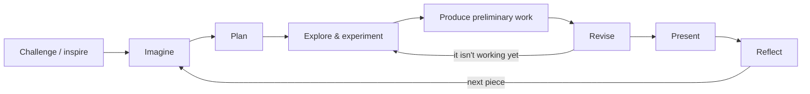

Every piece you make in this course — from a thirty-second improvisation to
the final [[Scene Study from a Story]] — moves through the same process. The
Ontario arts curriculum names its stages, and we will use those names all
year, because being able to say *where you are* in the process is the first
step to getting unstuck.

## A cycle, not a line

The stages look like a checklist, but the arrows matter more than the boxes.
Real work loops: you explore, produce something rough, revise, discover the
plan was wrong, and go back to exploring. That is the process working, not
failing.

Notice the two return arrows. Revision that sends you back to exploring is
normal — plan for it by producing preliminary work *early*, while there is
still time to loop. And reflection is not the end: what you learn presenting
this piece is the starting material for the next one. Your [[Drama Journal]]
lives mostly in that reflect stage, and the [[Learning Goals]] for each unit
tell you what to reflect *on*.

Groups move through the cycle too, and most group conflict is really a
process disagreement: one person is still imagining while another wants to
revise. Naming the stage out loud — "I think we're still exploring" — settles
more arguments than voting does.

## Being stuck is a location, not a verdict

Everyone lands in the gap between *imagine* and *produce*, where the idea in
your head is better than anything you can make yet. That gap does not mean
you lack talent; it means your taste is ahead of your skill, which is exactly
where a learner should be. The way out is never to wait for a better idea —
it is to produce preliminary work anyway. A rough [[Tableau]], two minutes of
messy improvisation, a page of [[Writing in Role]]: bad first drafts are the
toll the process charges, and every group pays it. The groups that look
effortless in week ten paid it in week two.

%%curriculum-start%%
## Curriculum connection

![[A1.1]]

![[B1.1]]
%%curriculum-end%%
