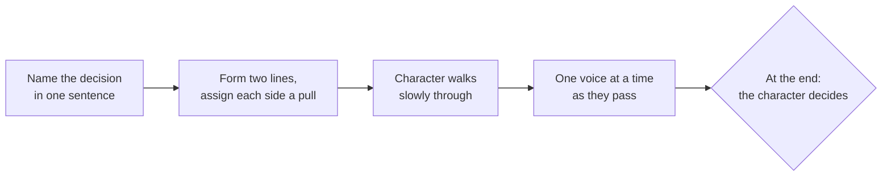

**Corridor of voices** — you will also hear it called *conscience alley* —
is the convention for the moment before a decision. The group forms two
lines facing each other, an arm's length apart. One performer, in role as
the character, walks slowly down the corridor. Each person they pass speaks
a pull: a reason, a memory, a warning, a temptation. One side pulls toward
the choice; the other pulls away.

At the far end, the character turns and tells us what they will do.

## How to run it

Some details make all the difference:

- The decision must be genuinely open. "Should Cinderella go to the ball" is
  settled; "should she tell the prince who she really is" is not.
- Voices speak *from inside the story's world* — as a memory, a parent, a
  fear, a promise — not as classmates offering advice.
- The walk is slow. The slower the walk, the more the audience feels the
  weight of the choice — that is [[Tension|tension]] made physical.
- Whispered voices often land harder than loud ones.

## What it is for

Corridor of voices turns an invisible thing — deliberation — into something
you can stage, hear, and [[B1.2|interpret]]. It forces the group to generate
*every* argument, including the ones they personally disagree with, which is
why it belongs with [[Role and Character]] work: a character is partly the
sum of the pulls they feel. It shares DNA with [[Thought Tracking]] — both
put private thought into the air — but here the thoughts argue with each
other.

> [!warning] The pitfall: the pile-up
> If voices overlap, the character hears noise instead of pulls, and the
> walk becomes a gauntlet. One voice per step. If your group cannot resist
> piling on, have the character pause in front of each speaker before moving
> on — stillness is a skill you already trained in [[Tableau]].

%%curriculum-start%%
## Curriculum connection

![[A2.2]]

![[B1.2]]
%%curriculum-end%%
