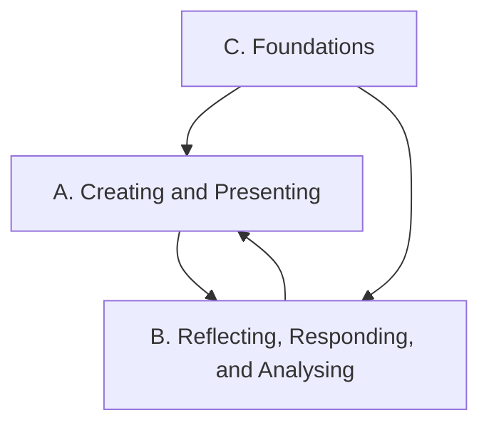

Everything we do in this course points at one or more of these
expectations, from **ADA1O — Drama, Grade 9, Open**. Lesson pages link
here so you can always see *why* we are doing something.

> [!info] Where these come from
> The wording below is the Ontario curriculum's own. See
> [[About These Expectations]].

The three strands work together: you create and present drama (A),
step back to reflect on and analyse it (B), and build up the
vocabulary, history, and habits that make both possible (C).

## Overall and specific expectations

### Strand A. Creating and Presenting
*By the end of this course, students will:*

![[A1. The Creative Process]]
![[A1.1]]
![[A1.2]]
![[A1.3]]

![[A2. Elements and Conventions]]
![[A2.1]]
![[A2.2]]

![[A3. Presentation Techniques and Technologies]]
![[A3.1]]
![[A3.2]]
![[A3.3]]

### Strand B. Reflecting, Responding, and Analysing
*By the end of this course, students will:*

![[B1. The Critical Analysis Process]]
![[B1.1]]
![[B1.2]]
![[B1.3]]

![[B2. Drama and Society]]
![[B2.1]]
![[B2.2]]
![[B2.3]]
![[B2.4]]

![[B3. Connections Beyond the Classroom]]
![[B3.1]]
![[B3.2]]
![[B3.3]]

### Strand C. Foundations
*By the end of this course, students will:*

![[C1. Concepts and Terminology]]
![[C1.1]]
![[C1.2]]
![[C1.3]]

![[C2. Contexts and Influences]]
![[C2.1]]
![[C2.2]]

![[C3. Responsible Practices]]
![[C3.1]]
![[C3.2]]
![[C3.3]]
