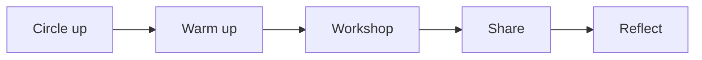

Most days in this course follow the same rhythm. Knowing the rhythm means you
never have to wonder what is coming — you can spend your attention on the work
instead.

## Circle up

We begin standing in a circle — always. It takes two minutes, it tells us who
is here, and it turns thirty individuals into one ensemble. Announcements
happen here, and so does the day's focus.

## Warm up

Voice and body first: five to ten minutes of games and exercises. They look
like play, and they are — but each one is training something specific, usually
[[Voice]], [[Movement and Gesture]], or the quick agreement that
improvisation runs on.

## Workshop

The middle and longest part of class. Some days we learn a new convention like
[[Tableau]] or [[Hot Seating]]; some days are rehearsal time for the current
task. Rehearsal time in class is the only rehearsal time this course expects —
use it hard.

## Share

Most workshops end with groups showing something, even something thirty
seconds long and unfinished. Sharing rough work early is the habit that makes
finished work good; the audience's job during shares is described in
[[Watching Like an Artist]].

## Reflect

The last few minutes belong to your [[Drama Journal]] — what we did, what you
noticed, what you would try next. It is short on purpose: done every day, it
becomes the record of how you have grown.

> [!tip] If you were away
> Check the class page in All Classes for the day you missed, then ask a
> classmate what the room discovered — the page holds the plan, but the
> discoveries happen live.
