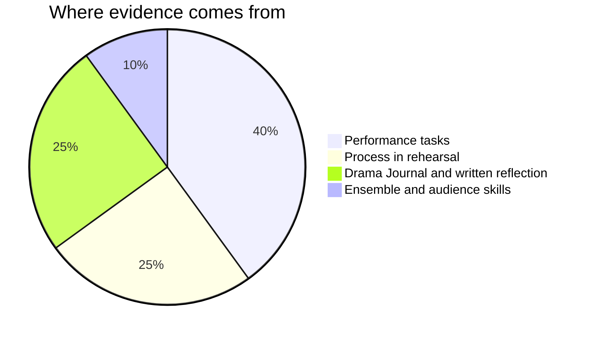

Marks in drama worry people, usually because of one misunderstanding: that
you are marked on talent. You are not. You are marked on **choices, process,
and growth** — things entirely inside your control.

## Where evidence comes from

**Performance tasks** are the pages in Tasks — each one lists its success
criteria before you start, phrased as things an observer could see, not
numbers.

**Process** means what you do with rehearsal time: offers made, offers
accepted, problems solved. A group that struggles honestly and adapts shows
more learning than one that coasts on an easy idea.

**Reflection** is your [[Drama Journal]] plus the short written notes some
tasks ask for. This is where [[B1.1|assessing your own role in the work]]
becomes visible — often the clearest evidence you have of what you know.

**Ensemble and audience skills** are the daily ones: warm-ups, focus,
generosity as an audience member. Small each day, large over a term.

> [!important] Rough early work is never penalised
> Shares of unfinished work are how the work gets good. The mark comes from
> where the work ends up and how you got it there — not from how it looked
> the first time anyone saw it.

If a mark ever surprises you, ask — the criteria on each task page are the
whole story, and [[Getting Help]] explains the best ways to reach me.

%%curriculum-start%%
## Curriculum connection

![[B1.1]]

![[B3.2]]
%%curriculum-end%%
