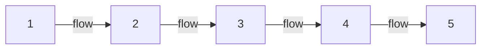

> [!abstract] At a glance
> Groups of 4 · rehearsed in class over four workshop days · performed
> Week 3 · roughly 90 seconds on stage

## What you are making

Your group will tell one complete story in exactly five
[[Tableau|tableaux]] — no more, no fewer. The limit is the assignment:
choosing which five moments a story cannot live without is a director's
judgement, and your audience must follow the story with no narration.

Between pictures, the group moves slowly and silently — freeze, flow, freeze:

Two requirements sit inside the sequence. Levels and
[[Focus and Emphasis|focus]] must be deliberate in every image — "why is
she the highest body in tableau three?" should have an answer. And exactly
one moment of [[Thought Tracking]] happens somewhere in the piece.

## How to work

1. Choose a story everyone already knows — a fairy tale spares you the plot.
2. Argue about the five moments before you stage anything. That argument is
   the most important rehearsal you will have; it is the exploring stage of
   [[The Creative Process]].
3. Build each image one at a time. Sculpt each other. Step out and look.
4. Rehearse the transitions as carefully as the freezes — the flow is
   performed too, and rushing it breaks the spell.
5. Decide where the [[Thought Tracking]] moment lands, and why there. The
   thought should say what the picture cannot — often the
   [[Tension|tension]] between what a character shows and what they think.

Rehearsal time is class time, and how you use it counts — [[How Marks Work]].

## Success criteria

| Quality | What it looks like from the audience |
| --- | --- |
| Story clarity | A stranger could retell the story after one viewing |
| Deliberate images | Levels and focus are choices, and the group can say why |
| Stillness | Freezes are truly still — eyes, hands, breath under control |
| Transitions | Flow is slow, silent, and controlled from first freeze to last |
| Thought tracking | The spoken thought reveals what the image alone could not |
| Ensemble | Everyone is essential in every tableau — nobody is decoration |

> [!success]- If your group is stuck (click to expand)
> Stuck groups almost always chose their five moments too fast. Ask: which
> picture could we cut with the story still surviving? If you find one, it
> is the wrong picture — replace it with the moment just before or just
> after the biggest change in the story.

%%curriculum-start%%
## Curriculum connection

![[A1.2]]

![[A2.2]]

![[C1.2]]
%%curriculum-end%%
