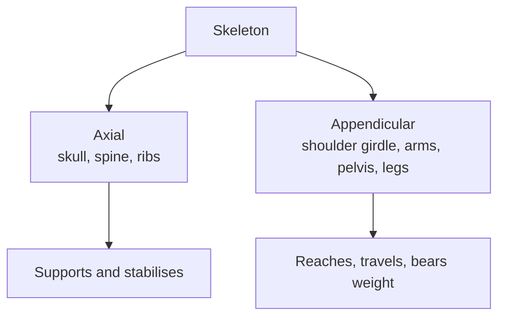

You have spent the period being told to lengthen the spine, turn out from the
hip, and stop gripping the front of the thigh. Those corrections are not
opinions about how dance should look. They are statements about a skeleton, and
they make far more sense once you know what is underneath the skin.

Bones do not move themselves. Muscles pull on them, and bones move where the
joints between them allow — and only there. Most studio injuries happen when a
body is asked for movement at a joint that cannot produce it, so the joint
borrows the range from somewhere else.

## Two halves of a skeleton

The **axial** skeleton is the centre line — skull, spine, ribcage. The
**appendicular** skeleton is everything that hangs off it. Dancers tend to
think about the appendicular half, because that is the half you can see in a
mirror. But an arm gesture that reads across a room is powered from the spine
and ribs, and a leg that feels heavy is usually a pelvis that is not supporting
it. This is the whole argument behind [[Alignment and Placement|alignment]].

## Joints decide what is possible

- **Ball and socket** — hip and shoulder. Rotation in every direction. This is
  where turnout lives. Not the knee, not the foot.
- **Hinge** — knee and elbow. Bend and straighten, in one plane, and that is
  all. Twisting a bent knee asks a hinge to be a socket.
- **Many small joints together** — the spine. No single vertebra does much;
  the whole column does a great deal, which is why articulating through the
  spine is slow to learn and worth learning.

## Why this changes your practice

Once you know the hip is the socket, "turn out from the top of the leg" stops
being something the teacher says and becomes something you can find. Once you
know the knee is a hinge, you understand why we never force a stretch by
twisting into it, and why [[The Standard Warm-Up]] moves joints through their
own ranges before asking for anything large.

You are not expected to memorise a skeleton for its own sake. You are expected
to say where a movement is happening in your body — which is also what
[[The Safe Dancer]] asks you to demonstrate.

%%curriculum-start%%
## Curriculum connection

![[C1.2]]
%%curriculum-end%%
