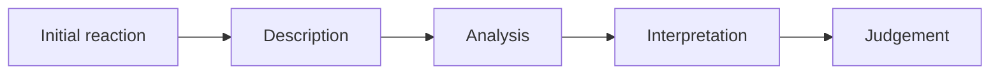

You have just watched something and you have a reaction. Fine — keep it. The
critical analysis process does not ask you to give up your opinion. It asks you
to *earn* it, by working through the stages in an order that stops you deciding
what a work means before you have finished looking at it. You will use the same
process on a professional performance, on another group's showing, and on video
of yourself. It is not a form to fill in. It is a sequence for slowing down.

**Initial reaction.** What happened to you as you watched — bored, gripped,
uncomfortable, confused? Write it immediately and do not tidy it. It is
evidence; by the third viewing you no longer have access to it.

**Description.** What is actually there, no explanation attached. Six dancers,
low light, nine minutes, unison for two of them, then one dancer stops.
Descriptions are checkable: two people describing a work should broadly agree.

**Analysis.** How the parts work together. Here the vocabulary earns its keep:
which elements of dance are doing the work, what form the piece is in, where
the changes fall. "The unison broke as the music thinned out" is analysis. It
is still not interpretation.

**Interpretation.** What you think it is about, and — the whole point — what
in the work makes you think so. An interpretation with no evidence from the
description and analysis is a guess about the choreographer's mood.

**Judgement.** Whether it succeeded, on its own terms first: did it achieve
what it appeared to be attempting? Then, if you like, whether that was worth
attempting. Both are legitimate. Neither is "I liked it."

## Naming what you are looking at

The process also helps you identify the *form*, and you identify a form by its
characteristics. Where is the weight? What does the spine do? Is the foot
pointed or flexed, and is that a rule or a choice? Is the rhythm in the music,
the feet, or the breath? The forms you meet in [[Forms From Around the World]]
are the ones you will recognise fastest, because you have felt them. You will
run the process formally in [[The Dance Review]], and the writing it produces
is the subject of [[Writing About Dance]].

%%curriculum-start%%
## Curriculum connection

![[B1.1]]
%%curriculum-end%%
