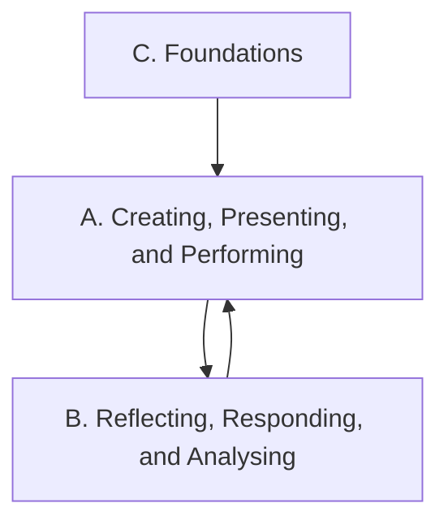

Everything this course does points at one or more of these expectations,
from **ATC1O — Dance, Grade 9, Open**. Every class, phrase, and task
links back to the codes it addresses, so you can always see *why* we are
doing something.

> [!info] Where these come from
> The wording below is the Ontario curriculum's own. See
> [[About These Expectations]].

The arrows are the shape of the course: foundations make the work
possible, the work is made and performed, and reflecting on it changes
what you make next.

## Overall and specific expectations

### Strand A. Creating, Presenting, and Performing
*By the end of this course, students will:*

![[A1. The Creative Process]]
![[A1.1]]
![[A1.2]]
![[A1.3]]
![[A1.4]]
![[A2. Choreography and Composition]]
![[A2.1]]
![[A2.2]]
![[A2.3]]
![[A3. Dance Techniques]]
![[A3.1]]
![[A3.2]]
![[A3.3]]
![[A4. Performance]]
![[A4.1]]
![[A4.2]]
![[A4.3]]

### Strand B. Reflecting, Responding, and Analysing
*By the end of this course, students will:*

![[B1. The Critical Analysis Process]]
![[B1.1]]
![[B1.2]]
![[B2. Dance and Society]]
![[B2.1]]
![[B2.2]]
![[B2.3]]
![[B2.4]]
![[B3. Connections Beyond the Classroom]]
![[B3.1]]
![[B3.2]]
![[B3.3]]

### Strand C. Foundations
*By the end of this course, students will:*

![[C1. Physiology and Terminology]]
![[C1.1]]
![[C1.2]]
![[C1.3]]
![[C2. Contexts and Influences]]
![[C2.1]]
![[C2.2]]
![[C2.3]]
![[C3. Responsible Practices]]
![[C3.1]]
![[C3.2]]
![[C3.3]]
