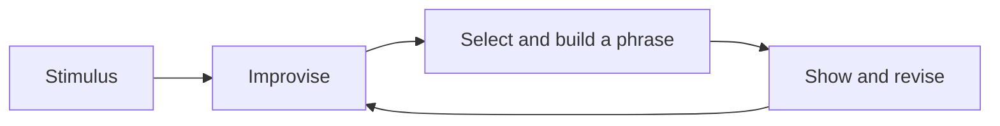

A short tour of what these pages can hold — partly so you can read them,
partly so a teacher taking this course over can write them.

## Tables

Most of what a dancer needs to compare fits a table.

| Element | The question it answers |
| --- | --- |
| Body | What is moving, and which part leads? |
| Space | Where, at what level, in what direction? |
| Time | How fast, how long, with what rhythm? |
| Energy | With what quality — sharp, sustained, suspended? |

A link inside a table cell needs its pipe escaped, or the cell breaks:
write `[[The Elements of Dance\|the elements]]` and it renders as
[[The Elements of Dance\|the elements]].

## Callouts

> [!tip] A tip
> Something to try in the studio tomorrow.

> [!warning] A warning
> Usually about safety, so it is said loudly.

A callout with a `-` after its type starts folded:

> [!success]- A folded block
> Used for a check-yourself question, so you get to think first. You just
> opened it, which is the demonstration.

## Diagrams

Small diagrams are written as text, so they can be edited without a
drawing program:



## Checklists

- [ ] Kit in the bag
- [ ] Journal entry written

> [!warning] These do not save
> A checkbox here is printed, not interactive. Nothing is recorded and
> the site does not know who you are. Copy the list into your journal.

## Footnotes

Useful for an aside that would interrupt the sentence.[^counts]

[^counts]: Counts in this course are spoken in eights unless a page says
otherwise — the convention most of the forms we work in share.

## What this course does not use

The site can typeset mathematics and highlight program code, and this
course does neither. Shown once so you know they exist:

$$\text{tempo} = \frac{\text{counts}}{\text{minute}}$$

```python
print("not used in this course")
```

Your work here is made of movement, video, and writing about both. If
you meet these in another course, this is the same site doing it.
