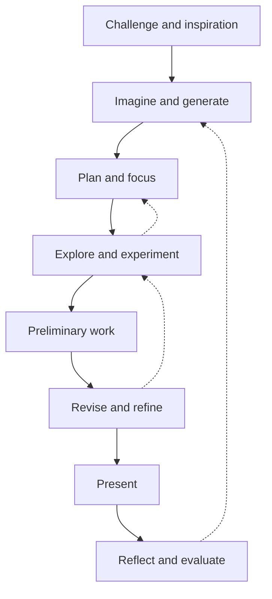

Everything you make this year moves through the same set of stages, and the
curriculum gives them names. We will use those names constantly, for one
practical reason: being able to say *where you are* is how you get unstuck.
"I'm stuck" is a mood; "I'm still exploring but trying to revise" is a plan.

The solid arrows are the tidy version. The dotted ones are what actually
happens: experimenting shows you the plan was wrong, revising sends you back
to the materials, and reflecting on a finished piece hands you the next idea.
None of that is the process breaking down. That *is* the process.

## Where each stage lives here

Imagining and generating happens in [[The Sketchbook]] — thumbnails and bad
ideas written down fast, because you cannot choose a good idea out of a set
of one. Exploring is what a studio period is for, and [[The Media Trials]] is
that stage as an assignment. Producing preliminary work means a rough version
early, while there is still time to change it; presenting is real; reflecting
is [[Assessing Your Own Work]].

## The gap everyone falls into

There is a stage between imagining and producing where the piece in your head
is far better than anything your hands can make yet. That gap is not a
verdict on your ability — your taste has run ahead of your skill, which is
where a learner should be. Waiting for a better idea never closes it;
producing something rough does. [[Working in a Series]] is built on that, and
[[The Sketchbook Habit]] is where you practise it until it stops being a
decision.

%%curriculum-start%%
## Curriculum connection

![[A1.1]]

![[C1.3]]
%%curriculum-end%%
