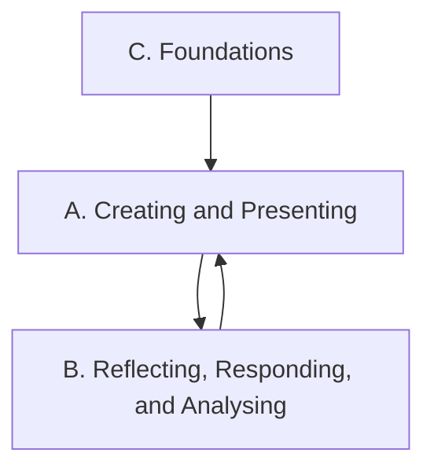

Everything this course does points at one or more of these expectations,
from **AVI1O — Visual Arts, Grade 9, Open**. Every studio period,
critique, and task links back to the codes it addresses.

> [!info] Where these come from
> The wording below is the Ontario curriculum's own. See
> [[About These Expectations]].

Foundations make the making possible; the making is reflected on; the
reflection changes what gets made next. That loop is the course.

## Overall and specific expectations

### Strand A. Creating and Presenting
*By the end of this course, students will:*

![[A1. The Creative Process]]
![[A1.1]]
![[A1.2]]
![[A1.3]]
![[A2. The Elements and Principles of Design]]
![[A2.1]]
![[A2.2]]
![[A3. Production and Presentation]]
![[A3.1]]
![[A3.2]]
![[A3.3]]

### Strand B. Reflecting, Responding, and Analysing
*By the end of this course, students will:*

![[B1. The Critical Analysis Process]]
![[B1.1]]
![[B1.2]]
![[B1.3]]
![[B1.4]]
![[B2. Art, Society, and Values]]
![[B2.1]]
![[B2.2]]
![[B2.3]]
![[B3. Connections Beyond the Classroom]]
![[B3.1]]
![[B3.2]]
![[B3.3]]

### Strand C. Foundations
*By the end of this course, students will:*

![[C1. Terminology]]
![[C1.1]]
![[C1.2]]
![[C1.3]]
![[C2. Conventions and Techniques]]
![[C2.1]]
![[C2.2]]
![[C3. Responsible Practices]]
![[C3.1]]
![[C3.2]]
![[C3.3]]
