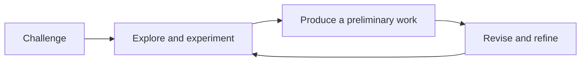

A short tour of what these pages can hold — partly so you can read them,
partly so a teacher taking this course over can write them.

## Tables

Most of what an artist needs to compare fits a table.

| Element | The question it answers |
| --- | --- |
| Line | How heavy, how fast, how certain? |
| Shape | What has an edge, and what shape are the gaps? |
| Value | Light or dark — does it still read when you squint? |

A link inside a table cell needs its pipe escaped, or the cell breaks:
write `[[The Elements of Design\|the elements]]` and it renders as
[[The Elements of Design\|the elements]].

## Callouts

> [!tip] A tip
> Something to try at your table tomorrow.

> [!warning] A warning
> Usually about a blade, a solvent, or dust, so it is said loudly.

A callout with a `-` after its type starts folded:

> [!success]- A folded block
> Used for a check-yourself question, so you get to think first. You just
> opened it, which is the demonstration.

## Diagrams

Small diagrams are written as text, so they need no drawing program:



## Checklists

- [ ] Sketchbook in the bag
- [ ] Trial annotated

> [!warning] These do not save
> A checkbox here is printed, not interactive. Nothing is recorded and the
> site does not know who you are. Copy the list into your sketchbook.

## Footnotes

Useful for an aside that would interrupt the sentence.[^elements]

[^elements]: This course follows the elements as listed in the subject
overview of the curriculum document, which is not quite the list in its
glossary — the difference is explained where the expectations live.

## Money

A dollar sign has to be escaped, or the page reads the rest of the line as
mathematics. Write `\$14` and you get \$14 — roughly what a year's personal
materials cost, bought new.

## What this course does not use

The site can typeset mathematics and highlight program code, and this
course does neither. Shown once so you know they exist:

$$\text{value} = \frac{\text{light reflected}}{\text{light falling}}$$

```python
print("not used in this course")
```

Your work here is made of marks, materials, and writing about both. If you
meet these in another course, this is the same site doing it.
