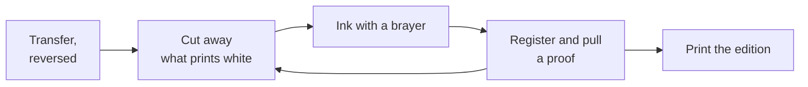

Printmaking is the one medium where you make a thing that makes the picture.
You cut a block, and the block prints — twenty times if you want it to.

We work in relief: the ink sits on whatever surface is left standing, so
everything you cut away prints as the colour of the paper. Beginners cut the
lines they want and pull a print of white lines on black — once.

## The sequence

The loop back from the proof is the part people skip. A proof is a test
print, where you find out what the block is actually doing — and since you
can take material away but never put it back, cut less than you think.

## The cutting, said plainly

Lino cutters are the most common cause of injury in a school art room, and
the injury is always the same: the tool slips forward off the block into the
hand holding it steady. Two habits prevent it. **Cut away from your body,
always**, and **keep your free hand behind the blade** — a bench hook holds
the block so that hand stays clear. A blunt blade slips more than a sharp
one, so say when a cutter stops biting.

## Registration and the press

Registration is how a print lands in the same place every time — a card with
the block and paper corners marked on it separates an edition from twenty
loose attempts.

The press roller carries a great deal of force. One person turns the handle,
the bed is checked clear before it moves, hair and sleeves are tied back, and
no hand goes near the roller while it turns.

## The edition

An edition is the set of prints from one block, numbered in pencil beneath
the image: `4/12` is the fourth print of twelve, with the title centred and
your signature at the right. Number honestly — that fraction tells a viewer
how many exist. [[Photographing Your Work]] documents them;
[[Materials and Safety]] covers the inks.

%%curriculum-start%%
## Curriculum connection

![[A3.1]]

![[C2.1]]
%%curriculum-end%%
