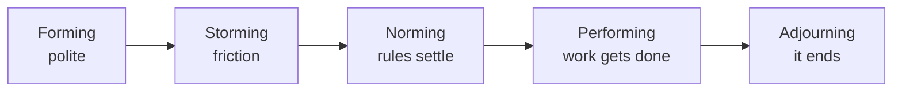

Every group you have ever been put into went through the same rough
sequence, including the ones that fell apart. Knowing the sequence will
not make the awkward part disappear — it will stop you from concluding
that the awkward part means the group is broken.

## The five stages

**Storming is not failure.** It is the stage where a group finds out
whose standards apply, who decides, and what happens when someone does
not deliver. Groups that skip it usually have not skipped it — they have
postponed it to a worse week.

## The roles people take

Watch any group for twenty minutes and you will see them: the one who
pushes for a decision, the one who keeps the peace, the one who asks the
question everyone was avoiding, the one who quietly does the work, and
the one who has stopped contributing but is still on the list.
Roles are not personalities; the same person plays a different one in a
different group.

## The kinds of group in an organization

| Kind | Example | What it is good at |
| --- | --- | --- |
| Formal | A department, a standing committee | Authority and accountability |
| Informal | The people who eat lunch together | Information, faster than any memo |
| Cross-functional | A project team drawn from three departments | Problems no single department owns |
| Electronic | A group that has never been in one room | Reach; it struggles with trust |

> [!tip] The informal network is real
> News travels through the lunch group before it travels through the
> org chart. A manager who only uses formal channels is always the last
> to know, and is regularly surprised by things everyone else saw coming.

You will watch all five stages happen to your own group in
[[The Team Build]] and then live through them for real in
[[The Team Project]].

%%curriculum-start%%
## Curriculum connection

![[B2.1]]

![[B2.2]]
%%curriculum-end%%
