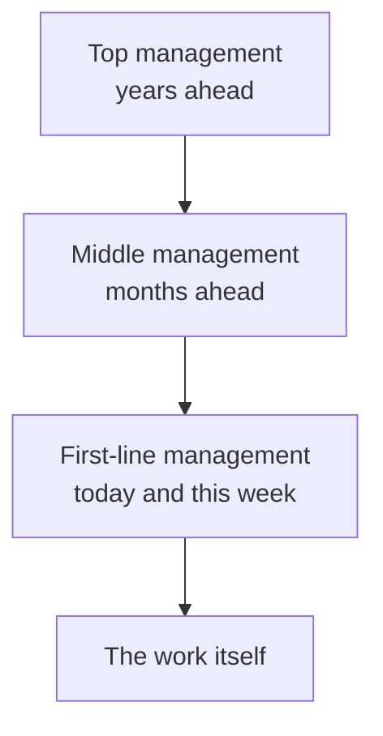

Ask three managers in the same company what they did yesterday and you
will get three unrelated answers. One rebuilt a schedule after two people
called in sick. One argued about next year's budget. One met a supplier
they will not deal with for eighteen months. All three were managing.

## Who is looking how far ahead

The useful distinction is not seniority — it is **time horizon**, and
what follows from it. A first-line manager's day is made of decisions
that must be right by Thursday. A top manager's decisions will not be
proved right or wrong until long after everyone has forgotten who made
them.

## What each level is actually asked for

| Level | Mostly responsible for | The skill that dominates |
| --- | --- | --- |
| Top | Direction, and the organization's relationship with the world | Conceptual — seeing the whole |
| Middle | Turning direction into plans other people can run | A working balance of all three |
| First-line | The work getting done, this week, by these people | Human and technical |

Notice what the right-hand column does as you go up: technical skill
matters less, and the ability to work through other people matters more.
The best programmer on the team is not automatically a good engineering
manager, and the reason is in that column, not in their character.

> [!warning] "Manager" is a job, not a rank
> A team lead who coordinates six people is doing management work whether
> or not the title says so, and a director who spends the week debugging
> is not. When you sort decisions in class, sort them by the work, not by
> the business card.

We use these levels constantly: when we ask *who would actually decide
this?* in a [[Cases/index|case]], the answer is nearly always a level
rather than a person.

%%curriculum-start%%
## Curriculum connection

![[A1.2]]
%%curriculum-end%%
