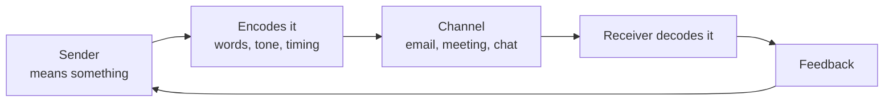

Communication looks simple until it fails, and then it turns out to have
had five places where it could.

The message that arrives is not the message that was sent. It is the
message the receiver *decoded*, using their own experience, mood, and
history with you.

## Where it breaks

| Barrier | What it sounds like afterwards |
| --- | --- |
| Cultural difference | "I thought they agreed" — when the reply was politeness, not assent |
| Difference in perception | "That's not what I meant at all" |
| The wrong channel | A three-paragraph email that should have been two minutes at a desk |
| Semantics | Two people using *soon*, *urgent*, or *draft* to mean different things |
| Noise | The message arrived during a crisis and was never really read |

> [!warning] Silence is not confirmation
> The most expensive assumption in management is that no reply means
> agreement. It usually means the message was not read, not understood,
> or not believed — and the difference matters, because each one has a
> different fix.

## The manager's asymmetry

Your words carry more weight than you intend. A passing remark from
someone with authority is heard as an instruction, a hint about
restructuring, or a judgement about someone's work. Say what you mean,
say when you are thinking aloud, and expect to be quoted.

We put this to the test in the case [[The Team That Stopped Talking]] and
fix it, deliberately, in [[Improving Communication]].

%%curriculum-start%%
## Curriculum connection

![[C1.1]]
%%curriculum-end%%
