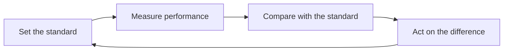

Control is the fourth managerial function and the least glamorous: after
planning, organizing, and leading, someone has to find out whether any of
it is working.

## The four steps

Each step fails in a characteristic way. Standards get set where they are
easy to measure rather than where they matter. Measurement becomes a
report nobody reads. Comparison happens too late to act. And the fourth
step — acting — is skipped most often of all, which turns the whole
process into paperwork.

## How control relates to the other three functions

Control is not a separate department. It is the loop that connects the
functions: it tells planning whether the plan was right, tells
organizing whether the structure is delivering, and gives leading
something concrete to talk about with a person. A manager who plans and
leads but never closes the loop is running on hope.

> [!tip] Set the standard before you need it
> A standard agreed in advance is a management tool. A standard invented
> after the results are in is an argument, and everyone in the room knows
> which one they are looking at.

## What to measure

Measure the few things that indicate whether the goal is being reached,
and expect people to optimise for exactly what you measure — including in
ways you did not intend. That is not cynicism; it is the most reliable
finding in the whole field, and it is why the choice of measure is a
management decision rather than an administrative one.

You will run this loop against an invented emergency in
[[The Crisis Hour]], and design one into [[The Change Plan]].

%%curriculum-start%%
## Curriculum connection

![[D5.1]]
%%curriculum-end%%
