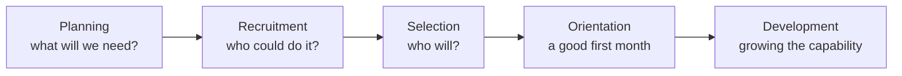

The human-resource process is how an organization gets the people its
objectives require — and it starts from those objectives, not from a
vacancy.

## Objectives first

An organization opening two locations next year needs supervisors it does
not yet have, and it needs them trained by summer. That is a
human-resource plan, and it comes out of the strategy. Hiring that begins
when someone resigns is not planning; it is reacting, and it is why
organizations end up choosing between two mediocre applicants in a hurry.

## Keeping the people you have

Recruitment is expensive and disruptive, so most of the value in this
process is in the second half of the diagram.

| Strategy | What it does |
| --- | --- |
| Orientation | Decides how fast a new person becomes useful, and how long they stay |
| Training | Builds the capability the strategy needs, before it is urgent |
| Career development | Gives people a reason to build a future here rather than elsewhere |
| Diversity policies | Widen who is recruited, heard, and promoted — and are judged by outcomes, not intentions |
| Labour–management relations | Where a union is present, the working relationship that makes everything else possible |
| Fair, predictable pay | Not a motivator on its own, but a reliable reason to leave when it is wrong |

> [!warning] Turnover is a measurement, not a verdict
> Some turnover is healthy. What matters is *who* leaves: an organization
> losing its strongest people has a different problem from one losing its
> weakest, and an exit interview held by the departing person's own
> manager will not tell you which.

You will sit on the other side of this process in
[[The Interview Panel]], and analyse a real hiring decision in
[[The Hiring Decision]].

%%curriculum-start%%
## Curriculum connection

![[E3.2]]

![[E3.3]]
%%curriculum-end%%
