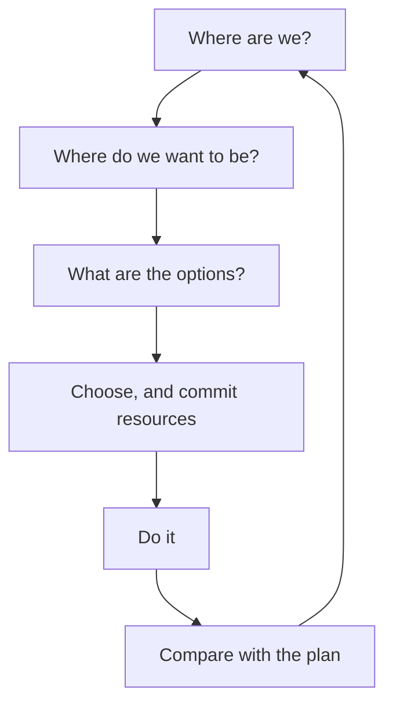

Planning is deciding, in advance, what you are going to do and how you
will know whether it worked. Organizations that skip it do not avoid the
decisions — they make them later, in a hurry, with less information.

## The process

The loop back to the top is the part people leave out, and it is the part
that makes planning worth doing twice.

## What it buys

| Benefit | What it looks like in practice |
| --- | --- |
| Coordination | Two departments' plans fit together because they were written in the same room |
| Flexibility | You have already thought about what to do if the main assumption fails |
| Time management | Effort goes to what was agreed to matter, not to whoever asked loudest |
| A standard to check against | Control has something to compare with — see [[The Control Process]] |

That third row deserves emphasis: a plan's real function is often to
protect the important work from the urgent work.

> [!warning] The plan is not the point
> "No plan survives contact" is true and is not an argument against
> planning. The value is in the thinking, the shared understanding, and
> the assumptions you wrote down — those survive contact even when the
> schedule does not. A team that planned together and then adapted is
> faster than a team that never planned at all.

You will build a real one in [[The Strategic Review]], and use planning
under time pressure in [[The In-Basket]].

%%curriculum-start%%
## Curriculum connection

![[D1.1]]
%%curriculum-end%%
