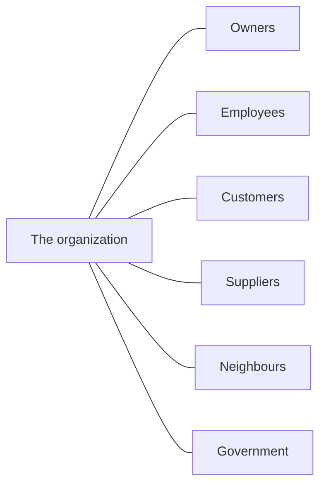

Corporate social responsibility is the claim that an organization owes
something to people who are not its owners. What it owes, and to whom, is
the argument.

## Who has a stake

A **stakeholder analysis** is the discipline of listing them, saying what
each one wants, and admitting where those wants collide. Done honestly it
is uncomfortable, because it makes explicit that a decision good for one
group is often paid for by another.

## What counts as evidence of commitment

Written commitments are cheap. When you assess a company's record, look
for things that cost something:

- Hiring, promotion, and retention data — not the policy, the numbers
- Accessibility work actually completed under the *Accessibility for
  Ontarians with Disabilities Act*, and what it cost
- What happened when a supplier failed an audit
- Environmental spending that shows up in the financial statements
- Whether anyone senior lost anything when a commitment was broken

> [!tip] Look for the trade-off they admit to
> Every honest CSR report contains a sentence about something the company
> chose *not* to do, and why. A report with no trade-offs in it is
> marketing, and you can say so — with the evidence — in your analysis.

We argue this out in the seminar [[Is a Company Responsible|Is a Company Responsible?]], and you
research one company's record for real in [[The Ethics Brief]].

%%curriculum-start%%
## Curriculum connection

![[A3.2]]
%%curriculum-end%%
