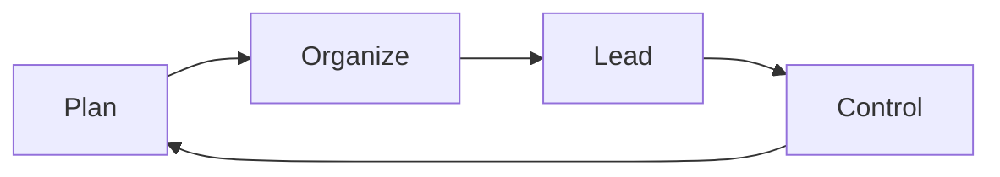
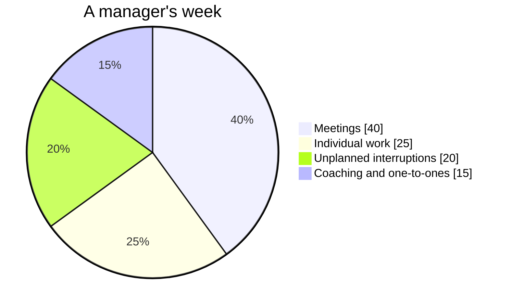

A tour of what these pages can hold — partly so you can read them, and
partly so a teacher taking this course over can write them.

## Tables

Most management thinking is a comparison, so most pages have a table.

| Structure | Grouped by | Cost |
| --- | --- | --- |
| Functional | Kind of work | Departments optimise themselves |
| Divisional | Product or region | Duplication |

A link inside a table cell needs its pipe escaped, or the cell breaks:
write `[[Traditional Structures\|the four structures]]` and it renders as
[[Traditional Structures\|the four structures]].

## Callouts

> [!tip] A tip
> Advice you can act on immediately.

> [!warning] A warning
> Something that goes wrong reliably, so it is worth saying loudly.

> [!note] A note
> Context that would interrupt the paragraph.

A callout with a `-` after its type starts folded:

> [!success]- A folded block
> Used for answers, so you get the chance to think first. You just
> clicked it, which is the whole demonstration.

## Diagrams

Small diagrams are written as text, which means they can be edited
without a drawing program:



A proportion is sometimes clearer as a pie — kept to a few slices,
because a slice under about three per cent prints its label on top of its
neighbour's:



## Checklists

- [ ] Read the case before Thursday
- [ ] Bring one headline

> [!warning] These do not save
> A checkbox here is printed, not interactive. Nothing is recorded and
> the site does not know who you are. Copy the list into your notebook if
> you want to work through it.

## Footnotes

Useful for a source or an aside that would otherwise interrupt.[^source]

[^source]: Ontario Ministry of Education, *The Ontario Curriculum, Grades
11 and 12: Business Studies*, 2006 — the document behind every page in
the curriculum folder.

## Money and numbers

Amounts are written as ordinary text — \$14, \$2.3 million — and that
backslash matters: without it the dollar sign can start a mathematics
span and the rest of the sentence disappears into it.

## What this course does not use

The site can typeset mathematics and highlight program code, and this
course does neither. Shown once here so you know the capability exists:

$$\text{Contribution margin} = \text{price} - \text{variable cost}$$

```python
def payback_years(investment, annual_saving):
    return investment / annual_saving
```

Both belong to other courses — accounting, computer science — and you
will not need either in BOH4M. Your numbers live in a spreadsheet and
your findings live in a memo.
