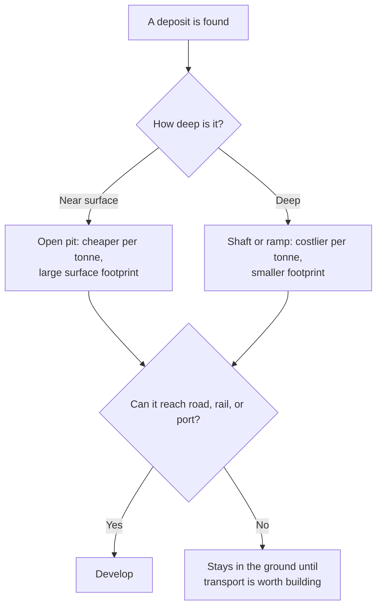

Nobody chooses an open pit because they like open pits. The deposit
chooses the method. Depth, rock type, grade, climate, and slope narrow
the options down to one or two before anyone has an opinion, and the
remaining choice is usually about cost.

That last box is not a rare outcome. It is the normal one. Canada has
known deposits that nobody is mining, not because the ore is poor but
because there is no way to move it. The Ring of Fire has been mapped for
years and remains largely undeveloped, and the central obstacle is that
it has no all-season road — a question that runs straight into whose
territory any such road would cross.

The same logic governs everything else. A forest on flat ground with one
dominant species is harvested differently from a mixed forest on a
mountainside. Drinking water pumped from an aquifer needs wells and
treatment for whatever the rock has dissolved into it; water taken from a
lake needs an intake, a plant, and protection of the whole watershed
upstream.

## Where innovation is actually happening

Extraction is a field of engineering, and the changes are specific.
Researchers are working on breaking rock underground without explosives,
which would remove a major source of danger and dust. Wind turbines are
being redesigned with de-icing systems so they keep turning through a
Canadian winter instead of shutting down in the season we most need them.
Canada's CANDU reactor design runs on natural, unenriched uranium and
heavy water, which is why it was adopted by countries without enrichment
facilities. Small modular reactors — smaller units meant to be built in
a factory and added one at a time — are being pursued partly because they
could serve communities too small or too remote for a conventional plant.
The first one in Canada is under construction now: the Canadian Nuclear
Safety Commission licensed Ontario Power Generation in April 2025 to build a
300-megawatt BWRX-300 at Darlington, cleared the reactor building foundation
in March 2026, and has an application from OPG, filed the same month, for a
licence to operate it.

Judge each of these the same way: what does it change about the
extraction, and what does it not change about the transport?

You will follow one resource from ground to market in
[[The Resource Investigation]], and the transport half of the problem is
[[Moving People and Goods]].

%%curriculum-start%%
## Curriculum connection

![[C1.3]]
%%curriculum-end%%
