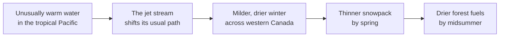

Canada is downstream of everywhere. The atmosphere and the ocean are one
connected system, and a change in it somewhere far away arrives here
eventually, changed in form and often delayed by months.

That last part is what makes these connections hard to see. The cause and
the effect are not in the same place, and they are not in the same week.

## One chain, all the way through

That warm-water phase is El Niño; the cool phase, La Niña, tends to push
the opposite way. Neither one causes a fire. What they do is shift the
odds, and shifted odds are exactly what a geographer studies.

## Three more that reach us

**Volcanoes.** A large eruption can throw sulphate particles into the
stratosphere, where they reflect sunlight and cool the whole planet
slightly for a year or two. The effect shows up in Canadian temperature
records as a dip that has nothing to do with Canada.

**Distant earthquakes.** The seafloor off Japan and the seafloor off
Vancouver Island are on the same ocean. A large enough undersea
earthquake on one side sends a tsunami to the other in a matter of hours.
British Columbia's coastal warning system exists because of exactly this.

**Tropical storms.** Storms that form near the equator can travel north
along the Atlantic seaboard. By the time they reach Nova Scotia they have
usually lost their tropical structure, but not their wind or their rain.
Hurricane Fiona in September 2022 came ashore in Atlantic Canada as a
post-tropical storm and still tore out coastline, power lines, and homes.

The moral is not that everything is connected — that is true and useless.
It is that a Canadian weather record often has a non-Canadian
explanation, and you will not find it by looking only at Canadian data.
The controls in [[Climate and What Controls It]] set the baseline; global
systems move it around. When you need to see the connection rather than
read about it, [[Using a Web GIS]] will let you put sea-surface
temperature and Canadian precipitation on the same screen.

%%curriculum-start%%
## Curriculum connection

![[B1.4]]
%%curriculum-end%%
