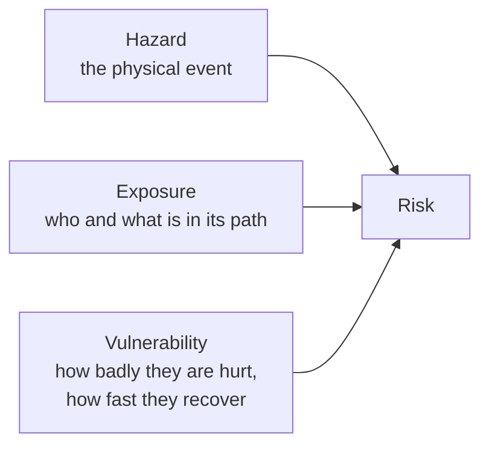

An earthquake in an empty valley is not a disaster. It is an earthquake.
Whether it becomes a disaster depends on what happens to be standing
there and how well that thing was built. Keeping those ideas separate is
the single most useful habit in this part of the course.

Read the diagram as a multiplication rather than a sum. If any one of the
three is near zero, the risk is near zero. That is the good news buried
in it: you almost never get to reduce the hazard, and you can nearly
always reduce the other two.

**Reducing exposure** means changing where things are. Flood-plain zoning
that stops new housing below a known water level. Snow sheds built over
highways and rail lines in the mountains so avalanches pass over the road
instead of onto it.

**Reducing vulnerability** means changing how things and people cope.
British Columbia's building code has been revised repeatedly so that new
construction can survive shaking that older construction cannot. A
cooling centre open during a heat warning does nothing about the heat and
a great deal about who dies in it.

Vulnerability is unevenly distributed, and that is a finding, not an
opinion. A community with one road in and out is more vulnerable to
wildfire than one with three. A person who cannot leave their home
without help is more vulnerable to any evacuation order. Older adults,
people in poor housing, and remote communities — including many First
Nations communities that have been evacuated repeatedly for fire and
flood — face the same hazard and a worse outcome.

Responses are getting more varied. Cultural burning, the deliberate
low-intensity burning of an area to reduce the fuel that would otherwise
feed a severe fire, was practised by many First Nations for a very long
time, suppressed under provincial fire policy, and is now being carried
out again in parts of Canada in partnership with fire agencies. It works
on the hazard side, which is rare.

You will assemble all three factors for one Canadian community in
[[The Risk Report]]. The question of whether a place should be built on
at all belongs to [[Should We Build There?]].

%%curriculum-start%%
## Curriculum connection

![[B2.3]]
%%curriculum-end%%
