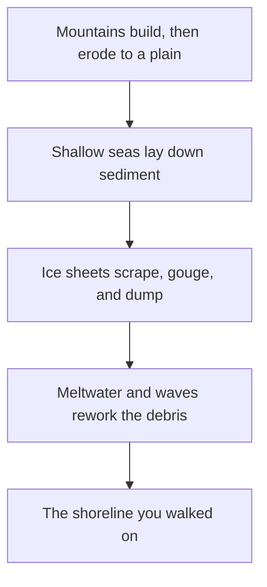

Nothing you stood on at the shoreline is finished. The cliff is losing
material, the beach is gaining it, and the whole surface is still slowly
lifting because a two-kilometre thickness of ice was taken off it. Canada
is not an old landscape resting. It is a young surface on very old rock.

Three clocks run at once, and confusing them is the most common mistake
in this unit.

## Three clocks

The **geological clock** runs in hundreds of millions of years. Plate
collisions folded the Appalachians and are still raising the Western
Cordillera. Long before either, volcanism and erosion stripped the Shield
down to its roots — which is why you can walk on rock there that formed
deep underground.

The **glacial clock** runs in thousands. The Laurentide Ice Sheet covered
most of Canada and pulled back from southern Ontario roughly thirteen
thousand years ago. It left almost everything you can see near school:
the till the woodlot grows in, the sand and gravel in the pits along the
highway, the basins the Great Lakes sit in. Where the ice was thickest,
the crust is still rebounding upward today, a few millimetres a year
around Hudson Bay.

The **hydrological clock** runs while you watch. Waves move sand along
the shore. The creek cuts its outside bend and drops the load on the
inside. In one storm a beach can change shape enough to notice.

The same landform often has two possible explanations, and the material
settles it. A ridge of sand and gravel might be a glacial deposit or a
beach built by waves. Rounded, sorted, and layered means water carried
it. Angular and jumbled means ice dumped it where it stood. Learning to
read the difference is most of what field geology is.

Every physical region in [[Canada's Physical Regions]] is a different
combination of these three clocks. When you write up
[[The Shoreline Study]], name which clock your evidence belongs to.

%%curriculum-start%%
## Curriculum connection

![[B1.2]]
%%curriculum-end%%
