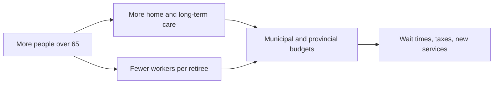

Population change is slow, visible years in advance, and still catches
communities unprepared — because the numbers move quietly and the consequences
arrive all at once, in the form of a wait-list.

## Aging is the change with the longest reach

Close to one in five people in Canada is now 65 or older, and the share keeps
climbing as a very large generation crosses that line. Follow what that does.

Every arrow is a decision someone has to make, and those decisions belong to
different governments. Health care is provincial, housing mostly municipal, the
pension federal, the sidewalk a council item. Nobody owns the whole chain,
which is why aging is easy to see coming and hard to prepare for.

## The same trend, different places

A trend is national; its effects are local, and they are not uniform. A rural
township losing young adults and gaining retirees faces closing schools and a
shrinking tax base. A fast-growing suburb needs schools built now, and will
need to reuse them in thirty years. Indigenous populations in Canada are young
and growing faster than the population as a whole, so the pressing needs there
are schools, housing, and health services that work in the community's own
language and setting — not long-term care beds.

## Opportunity and challenge are the same fact

Growth brings labour, customers, taxes, languages and skills a community did
not have. It also brings pressure on housing, transit, clinics and green space,
and discrimination that makes a newcomer's first years harder than they had to
be. Both sentences describe one event. Writing only one is advocacy, not
geography.

The honest form is: *this change creates X for these people and Y for those
people, over this timeframe.* Name who, and name when. A challenge in year two
is often an advantage in year ten.

Which pressures a government can act on is [[Policy Responses]], and we argue
the local version in [[What Do We Owe the Next Community|What Do We Owe the Next Community?]].

%%curriculum-start%%
## Curriculum connection

![[D2.1]]

![[D2.3]]
%%curriculum-end%%
