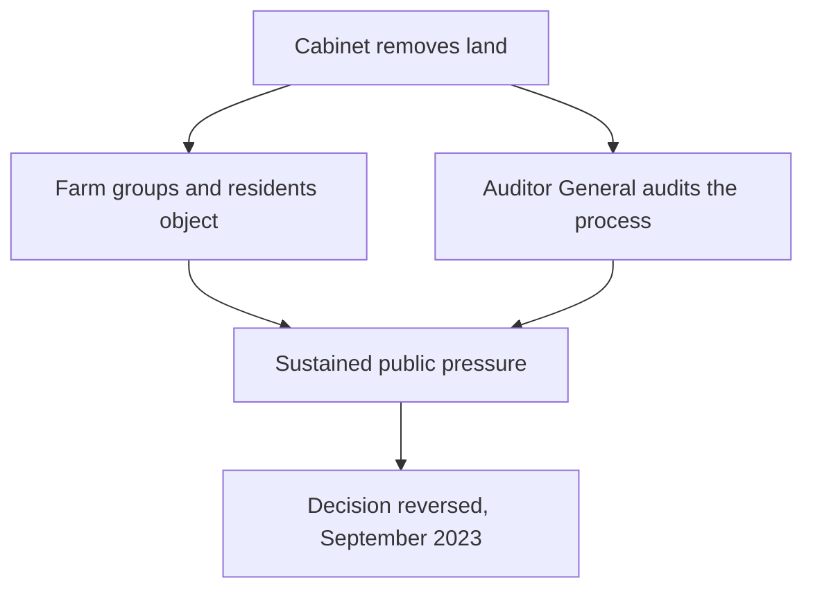

Resource decisions rarely come down to one person signing one page. They come
out of a system where several bodies each hold part of the authority, and where
pressure from outside that system sometimes moves more than a vote does.

## A decision that got reversed

In November 2022 the Ontario government removed roughly 3,000 hectares from the
Greenbelt — protected farmland and water recharge lands around the Greater
Toronto Area — to allow housing. What followed is the clearest recent example
of Canadian accountability machinery running.

The Auditor General reported in August 2023 that the process could not be
defended and that the removals stood to benefit a small number of landowners
enormously. A minister resigned; the removals were cancelled in September.

What made this work was that an independent officer of the legislature had the
legal power to read the files, and that the objections lasted longer than a
news cycle. Not every campaign has either.

## Influence comes in different kinds

Governments hold jurisdiction — the legal right to decide. Industry holds
capital and expertise, and often writes the studies a decision rests on.
Advocacy organizations hold attention. Community organizations hold local
knowledge no consultant flying in has. Individuals hold votes, purchases, and
the willingness to show up.

Ownership is a fifth kind, and it changes everything. The Wataynikaneyap
transmission line in northwestern Ontario — 1,800 kilometres, finished in 2024,
connecting remote First Nations that had run on diesel — is majority-owned by
the First Nations it serves.

Consultation and consent are not the same thing, and the difference is usually
the whole argument. Whether a group was heard, and whether it could say no, are
separate questions worth asking of every case.

Trace the ownership and the jurisdiction before the argument —
[[Land, Treaty, and Title]] sets out why. The hardest version of this is the
seminar [[Whose Land Is It?]].

%%curriculum-start%%
## Curriculum connection

![[C2.4]]
%%curriculum-end%%
