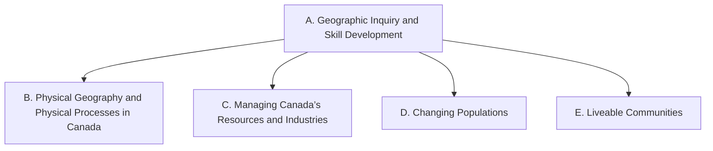

Everything this course does points at one or more of these expectations,
from **CGC1W — Exploring Canadian Geography, Grade 9, De-streamed**.
Lessons, fieldwork, and tasks link here, so you can always see *why* we
are doing something.

> [!info] Where these come from
> The wording below is the Ontario curriculum's own. See
> [[About These Expectations]].

Strand A runs through the whole course rather than sitting in one unit —
its own stem says *throughout this course* — which is why it points at
all four of the others.

## Overall and specific expectations

### Strand A. Geographic Inquiry and Skill Development
*Throughout this course, students will:*

![[A1. Geographic Inquiry]]
![[A1.1]]
![[A1.2]]
![[A1.3]]
![[A1.4]]
![[A1.5]]
![[A1.6]]
![[A2. Developing Transferable Skills]]
![[A2.1]]
![[A2.2]]
![[A2.3]]
![[A2.4]]

### Strand B. Physical Geography and Physical Processes in Canada
*By the end of this course, students will:*

![[B1. Characteristics of Canada’s Natural Environment and the Impact of Physical Processes]]
![[B1.1]]
![[B1.2]]
![[B1.3]]
![[B1.4]]
![[B1.5]]
![[B2. Interactions between the Natural Environment and Human Activities]]
![[B2.1]]
![[B2.2]]
![[B2.3]]
![[B2.4]]
![[B2.5]]

### Strand C. Managing Canada’s Resources and Industries
*By the end of this course, students will:*

![[C1. Natural Resources and Industries in Canada]]
![[C1.1]]
![[C1.2]]
![[C1.3]]
![[C1.4]]
![[C1.5]]
![[C1.6]]
![[C1.7]]
![[C1.8]]
![[C2. Sustainability and Economic Development]]
![[C2.1]]
![[C2.2]]
![[C2.3]]
![[C2.4]]
![[C2.5]]

### Strand D. Changing Populations
*By the end of this course, students will:*

![[D1. Demographic Patterns and Trends]]
![[D1.1]]
![[D1.2]]
![[D1.3]]
![[D1.4]]
![[D1.5]]
![[D2. Population Issues]]
![[D2.1]]
![[D2.2]]
![[D2.3]]
![[D2.4]]

### Strand E. Liveable Communities
*By the end of this course, students will:*

![[E1. Land Use in Communities]]
![[E1.1]]
![[E1.2]]
![[E1.3]]
![[E1.4]]
![[E2. Sustainability of Human Systems and Communities]]
![[E2.1]]
![[E2.2]]
![[E2.3]]
![[E2.4]]
![[E2.5]]
