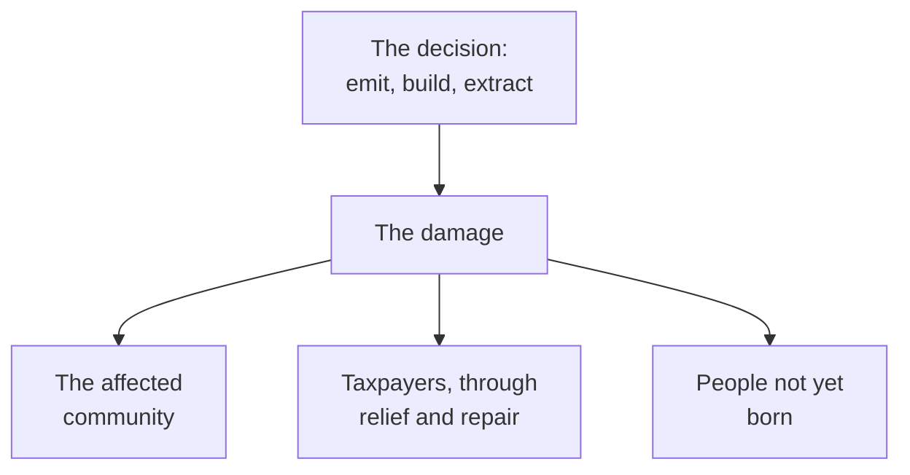

**The question:** a storm floods a subdivision, a mine leaves tailings, a
heat wave overwhelms a hospital. The bill is real and somebody pays it.
Who should?

The bill rarely lands where the decision was made:

## Prepare

Bring one Canadian event or site — a flood, a wildfire, an ice storm, a
contaminated property — with a year, a place, and one cost figure you can
source. [[A Changing Climate]] and [[Hazard, Exposure, Risk]] supply the
concepts; the number is your job.

## Four claims about who pays

**The polluter.** Whoever caused it pays — clean in principle, and hard
the moment the cause is diffuse, decades old, or a company that no longer
exists.

**Taxpayers.** Disasters are collective misfortune and public money is
how a country shares risk. The objection: pooling the cost removes the
signal, so the same street gets rebuilt in the same place.

**The affected community.** People chose the shoreline lot and the view.
The objection is sharp — many did not choose, could not afford elsewhere,
or were there long before the hazard maps existed.

**Future generations.** Borrowing to repair is defensible for
infrastructure that lasts, indefensible when it pays to avoid a decision.

## In the seminar

Split your event's cost across the four, in percentages, and defend it.
Then apply [[How Communities Value Land and Water]]: which claim does
each community in your case accept, and does anyone agree with anyone?
Finish on what your split does to the *next* decision — payment rules are
incentives too, which is the argument underneath [[The Risk Report]].

%%curriculum-start%%
## Curriculum connection

![[B2.4]]

![[B2.5]]
%%curriculum-end%%
