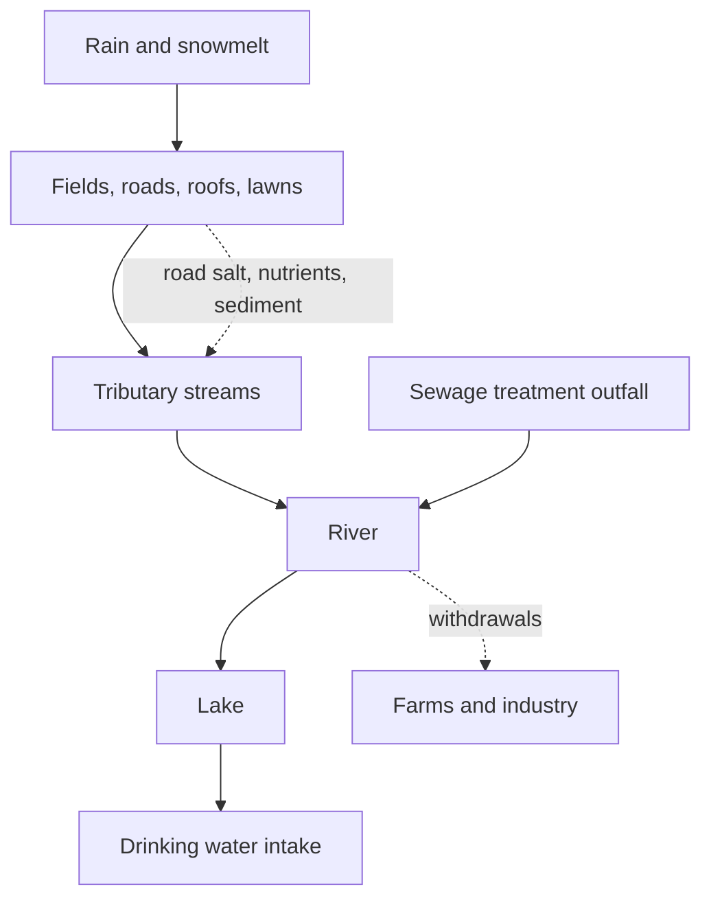

Every place in Canada is inside a watershed — all the land draining to one
point. Draw that boundary around where you live and you have drawn the
only map on which a water argument makes sense, because everything landing
on that ground eventually arrives at the same place.

## The situation

Canada holds a very large share of the world's fresh water, but much of it
is stored rather than renewed each year, and much of what flows drains
north, away from the southern band where most people live. Abundance and
accessibility are two different measurements. In southern Ontario the
water that matters is mostly the Great Lakes basin, and its watersheds are
among the most heavily used in the country.

Trace what enters. Road salt applied all winter arrives in spring.
Nutrients from fertilizer and manure arrive with the first heavy rain
after application. Sediment arrives whenever bare soil meets moving water.
Treated sewage arrives continuously and legally. None is a catastrophe
alone, and all of them are cumulative.

Then trace what humans changed about the speed. Tile drainage, straightened
channels, drained wetlands and paved surfaces all move water off the land
faster than soil and marsh did. Faster water means higher flood peaks
downstream and lower flows between storms — one alteration producing both
problems, which is why "more floods *and* more droughts" is not a
contradiction.

## Who draws from it, and who decides

Municipal intakes supply drinking water; farms irrigate; industry cools
and washes; rural households pump from their own wells. Above a threshold
volume Ontario requires a permit to take water — find the current
threshold and the public register before quoting either.

Authority is deliberately split. A municipality controls what is built and
runs the treatment plants; a conservation authority maps floodplains and
regulates development near water; the province permits withdrawals and
sets drinking-water standards; the federal government carries fisheries
and navigation responsibilities; First Nations hold treaty and territorial
interests and their own governments; and Great Lakes decisions are bound
by long-standing Canada–United States arrangements. Find out which of
those actually decides in your watershed before writing about "the
government."

## Questions

1. Whose land is upstream of your school's drinking water, and what does
   that land do for a living?
2. Pavement and tile drainage were both installed for good reasons. What
   would it cost, and who would pay, to undo either?
3. A treated sewage outfall is legal and continuous. Why does "legal" not
   settle the question?
4. Split authority means no single body can fix a watershed alone. Design
   flaw, or safeguard? Argue both.
5. If withdrawals were capped, who should get the last permit — the town,
   the farm, or the factory that employs the town?

Take it to the ground in [[The Shoreline Study]], and set the mechanism
against [[Changing the Land]] and
[[How Communities Value Land and Water]].

%%curriculum-start%%
## Curriculum connection

![[B2.2]]

![[C1.2]]
%%curriculum-end%%
