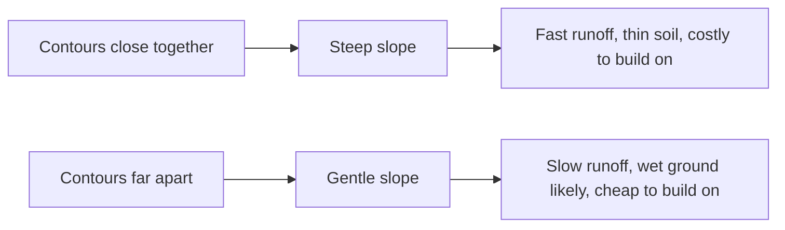

A topographic map is the only map that tells you the shape of the ground.
Roads, boundaries and land cover are drawn on top of that shape — so once
you can read the shape, the rest of the map explains itself.

## Contours

A contour joins points of equal elevation. The **contour interval** is the
vertical distance between one line and the next, printed in the margin;
every fifth line is heavier and labelled, and that **index contour** is
the one you count from. Three rules do most of the work:

- Contours never cross, because a point cannot have two elevations.
- Contours close on themselves. A ring inside a ring is a hill; a ring
  with ticks pointing inward is a hollow.
- Where a contour crosses a stream it bends into a **V pointing
  upstream** — uphill, against the flow.

That last rule finds the direction of drainage on a map with no blue line
labelled at all.

## Spacing is slope

Read that chain both ways. Steep ground sheds water quickly, so the stream
below it rises quickly — which makes contour spacing upstream part of a
flood argument downstream.

## Scale, grid, symbols

**1:50 000** means one unit on the map is 50 000 of the same units on the
ground: 1 cm to 500 m, 2 cm to the kilometre. The ratio survives
photocopying badly and the printed bar scale does not, so trust the bar.

Canadian sheets carry a grid of numbered squares. A **four-figure
reference** names one square, eastings before northings; a **six-figure
reference** splits it into tenths and lands you within about 100 m. Along
the corridor, then up the stairs.

Colour is the first pass — blue water, green vegetation, brown relief,
black built features, red major road. The legend is the second, and worth
two minutes, because Canadian sheets distinguish things a city map does
not: intermittent streams, muskeg, portages, cut lines.

## Where to get one

[Toporama](https://atlas.gc.ca/toporama/en/index.html) renders current
federal topographic data in a browser, free and with no account (accessed
August 2026). Scanned paper sheets download free through
[geo.ca](https://geo.ca/home/), but that scanned series is flagged as a
historical archive with nothing added after 2012 — fine for contours,
wrong for anything built recently.

Take this to the ground in [[The Shoreline Study]], and put other data on
top of it in [[Using a Web GIS]].

%%curriculum-start%%
## Curriculum connection

![[A1.4]]
%%curriculum-end%%
