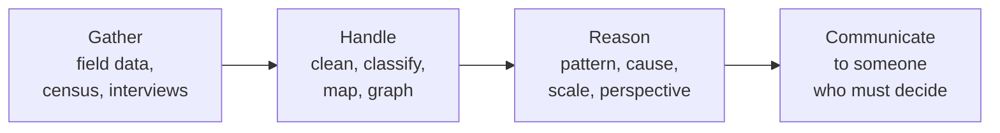

An honest inventory, written in Unit 3 while there is still term left to
act on it: what this course is actually building in you, with a specific
piece of your own work behind each claim.

Geographic investigation is not one skill. It is four, chained, and the
chain breaks at whichever link you have not practised:

## Write one paragraph per link

For each of the four, name **one** thing you did this term, when, and
what it produced. "I can handle data" is worth nothing. "I recoded the
census age brackets for [[The Population Profile]] because the published
groupings hid the shift I was looking for" is evidence. If a link has no
example yet, that is your finding — say so, and name the upcoming task
where you will fix it.

## The STEM connection, concretely

Say which of these you have done rather than which sound impressive:
chosen class intervals and defended them (mathematics); worked out why an
instrument or a satellite image reads as it does (science); used
coordinates, layers, and projections in [[Using a Web GIS]] (technology);
judged how a structure meets a physical process at the shoreline
(engineering). Geospatial work sits at the intersection, which is why
[[Careers in Geography]] lists jobs in all four and in the skilled trades.

## Where it lands outside this room

Pick one skill and one setting that is not school — a job, a household
decision, a claim someone made online that you now know how to check. Be
specific: "reading a scale bar" is a skill; "I worked out from the site
plan that the lot was smaller than the listing implied" is a transfer.

## Revisit in Unit 4

Come back after [[The Local Inquiry]] and add one paragraph: which link
in the chain actually failed under pressure? That paragraph is worth more
than the four above it, and it feeds [[Where You Stand]].

%%curriculum-start%%
## Curriculum connection

![[A2.1]]
%%curriculum-end%%
