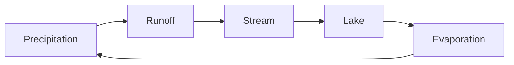
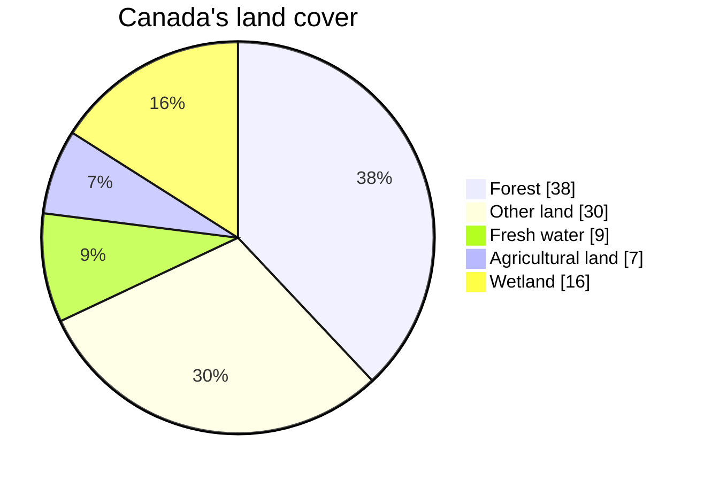

A tour of what these pages can hold — partly so you can read them, and
partly so a teacher taking this course over can write them.

## Tables

Most geography is a comparison, so most pages have a table.

| Region | Dominant rock | What that means for building |
| --- | --- | --- |
| Canadian Shield | Ancient bedrock, thin soil | Blasting, and shallow foundations on rock |
| Interior Plains | Deep sedimentary layers | Deep soils, and settling to design for |

A link inside a table cell needs its pipe escaped, or the cell breaks:
write `[[Canada's Physical Regions\|the regions]]` and it renders as
[[Canada's Physical Regions\|the regions]].

## Callouts

> [!tip] A tip
> Something you can act on straight away.

> [!warning] A warning
> Something that goes wrong reliably, so it gets said loudly.

A callout with a `-` after its type starts folded:

> [!success]- A folded block
> Used for answers and check-yourself questions, so you get the chance
> to think first. You just opened it, which is the demonstration.

## Diagrams

Diagrams here are written as text, so they can be edited without a
drawing program:



A proportion is sometimes clearer as a pie — kept to a few slices,
because a slice under about three per cent prints its label on top of
its neighbour's:



Those five figures are rounded approximations from Natural Resources
Canada's land-cover reporting — accurate enough to argue with, and you
should check them before you quote them.[^landcover]

[^landcover]: A footnote is the right place for a caveat like that: it
keeps the qualification without breaking the sentence. Every number in
this course wants a source and a year.

## Checklists

- [ ] Notebook, pencil, closed shoes
- [ ] Read the fieldwork page before we go

> [!warning] These do not save
> A checkbox here is printed, not interactive. Nothing is recorded and
> the site does not know who you are. Copy the list into your notebook.

## Numbers and money

Amounts are ordinary text — \$14, \$2.3 million — and that backslash
matters: without it the dollar sign can start a mathematics span and
swallow the rest of the sentence.

## What this course does not use

The site can typeset mathematics and highlight program code, and this
course does neither. Shown once so you know they exist:

$$\text{population density} = \frac{\text{population}}{\text{area}}$$

```python
def density(population, area_km2):
    return population / area_km2
```

You will calculate densities in this course — in a spreadsheet, where
that arithmetic belongs. The equation and the code are here to show the
site's range, not the course's.
