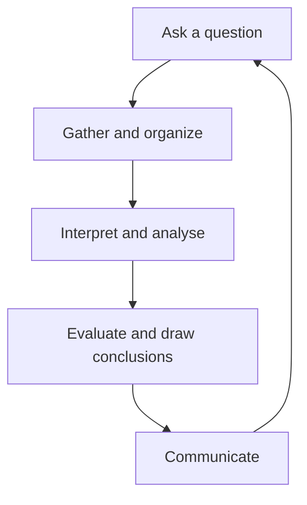

Geography answers questions about places, and the process below is how
this course does it. You will use it in every unit, and the whole of
[[The Local Inquiry]] is one long turn through it.

## The five moves

It loops on purpose. Most good inquiries change their question once, in
the middle, because the evidence turned out to be about something else.

## Asking a question worth answering

| Weak | Stronger | Why |
| --- | --- | --- |
| Is climate change bad? | How has the frequency of ice-free days on this shoreline changed since 1990? | Answerable with evidence |
| Why is Toronto big? | Which factors best explain where Ontario's population growth went between the last two censuses? | Specific, and testable |
| Should we protect farmland? | What would this municipality give up by approving housing on the 40 ha north of town? | Local, and has a cost in it |

A question is ready when you can say what evidence would answer it, and
what answer would surprise you.

## Gathering without drowning

Decide what you need before you search. Two datasets used properly beat
nine collected. Primary evidence — what you observed, measured, or were
told directly — is worth more here than another article, and it is the
thing you can actually get on a field day.

> [!tip] Write your sources down as you go
> Every year somebody loses a mark for a figure they cannot re-find. See
> [[Citing Geographic Sources]], and keep the notebook current.

## Interpreting

This is where the four concepts do their work — see
[[The Concepts of Geographic Thinking]]. Ask what is significant about
*where* this is, what the pattern is, what is connected to what, and
whose perspective changes the answer.

## Communicating

Match the form to the audience: a map for a pattern, a graph for a
trend, a paragraph for a cause, a brief for a decision-maker. Say what
you found, how confident you are, and what you would need to be surer.

%%curriculum-start%%
## Curriculum connection

![[A1.1]]

![[A1.6]]
%%curriculum-end%%
