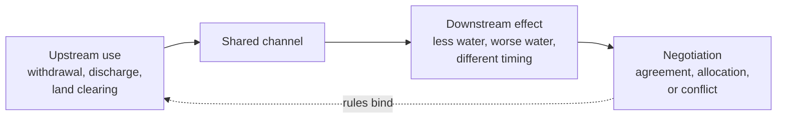

Water does not respect a boundary drawn by anybody. A drainage basin is
one physical system that may be divided among municipalities, provinces,
nations and treaty territories, and every one of them can act in ways
that arrive downstream.

The dotted arrow is the hard part. Physical effects travel downstream
automatically; obligations travel upstream only if somebody has agreed to
them.

## What agreements try to fix

Canada and the United States share the Great Lakes basin and have built
an unusually dense set of instruments around it: the Boundary Waters
Treaty of 1909 and the International Joint Commission it created, and the
Great Lakes Water Quality Agreement, first signed in 1972 and most
recently amended in 2012. Broader environmental instruments work the same
way at other scales — the Species at Risk Act nationally, the Montreal
Protocol on ozone-depleting substances internationally, and the Paris
Agreement on greenhouse gases.

Their track records differ sharply, and the comparison is instructive.
The Montreal Protocol addressed a small number of substances with
identified substitutes and a small number of producers; a climate
agreement addresses the energy basis of every economy. Judging an
agreement means asking what it actually required, of whom, and whether
anyone checked.

## Sharing is not only between countries

Within a single Canadian watershed, the parties can include farms
withdrawing for irrigation, municipalities drawing drinking water and
discharging treated effluent, industry, conservation authorities holding
the flood mandate, and First Nations whose treaty and inherent rights
attach to those waters and whose consent and jurisdiction are not
satisfied by consultation alone. Ontario's watershed-scale conservation
authorities exist precisely because the physical unit and the political
unit do not line up.

Rising demand, changing precipitation and moving populations will
sharpen these questions rather than settle them, which is why
[[A Warming Planet]] ends up being a resources page as much as a climate
one. Argue one real case in [[Who Should Pay to Rebuild?]], and see what
a shortage does to the people sharing a basin in
[[The 2021 Prairie Drought]].

%%curriculum-start%%
## Curriculum connection

![[D1.1]]

![[D1.2]]

![[D1.3]]

![[C1.3]]
%%curriculum-end%%
