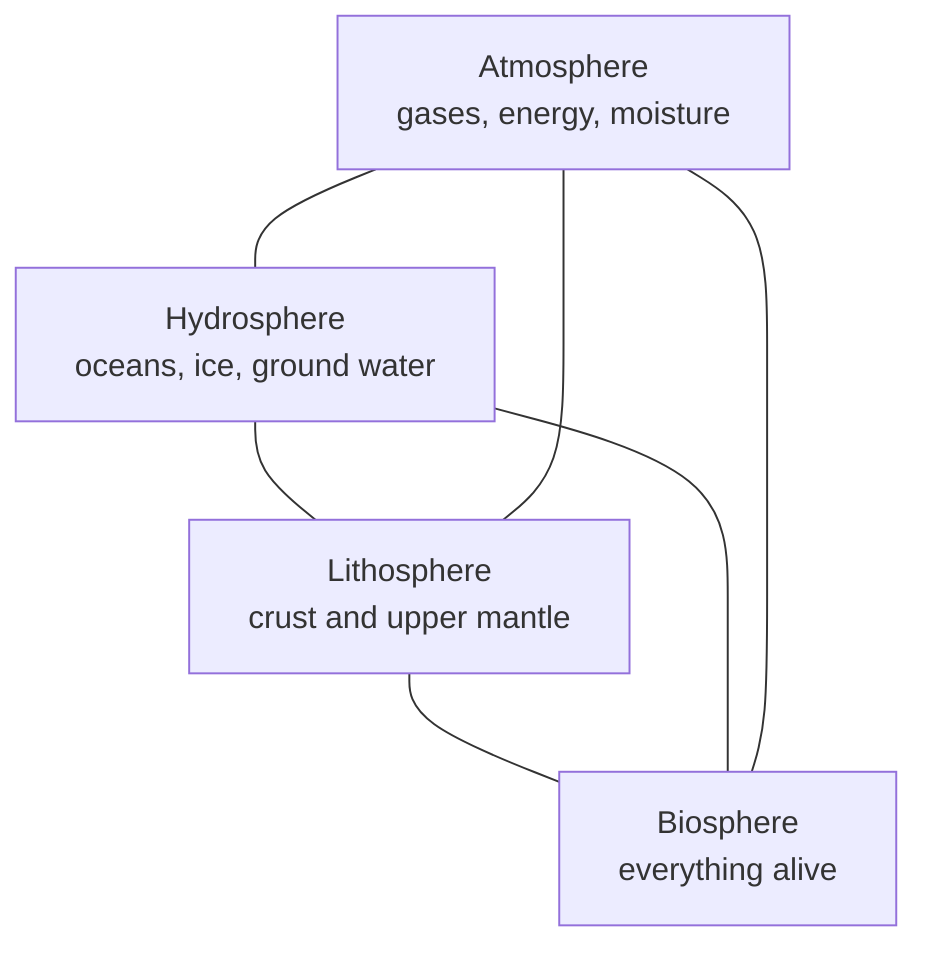

Physical geography divides the planet into four overlapping systems so
that a process can be traced from one to another. The division is a
convenience, not a fact about the Earth — every interesting thing in this
course happens where two of them meet.

Six edges join four spheres, and each edge is a process. Rain falling on
rock is atmosphere meeting lithosphere; a root splitting that rock is
biosphere doing the same job more slowly. When you cannot explain
something, ask which two spheres are in contact and what is moving
between them — energy, water, sediment, or carbon.

## Inside as well as outside

The four outer spheres sit on top of internal ones. The **core** — a
solid inner and a liquid outer part — drives the magnetic field that
deflects charged particles from the Sun. The **mantle** carries the slow
convection that moves plates. Neither is observable from the surface, and
both are inferred largely from how earthquake waves change speed and
direction as they pass through the Earth.

That inference matters for how you treat this knowledge. Nobody has
sampled the core. What we have is a model that predicts wave arrivals
accurately, which is a strong reason to accept it and not the same thing
as having seen it.

## The order they arrived in

Earth's early atmosphere was outgassed from the interior and was nothing
like the present one. Free oxygen accumulated only after photosynthetic
organisms had been producing it for a very long time — the biosphere
changed the atmosphere, rather than merely adapting to it. Liquid water
persisted because Earth's distance from the Sun and its atmospheric
pressure kept it from boiling away or freezing solid, a coincidence taken
up in [[Climate and Its Controls]].

Hold on to the direction of that arrow. Living things are not only
products of the physical environment; they are agents within it, which is
why [[Soils]] belongs to two spheres at once, and why
[[Human Impact on Physical Systems]] is a geography question rather than
only an ethical one.

%%curriculum-start%%
## Curriculum connection

![[B3.2]]

![[D3.1]]

![[D3.3]]
%%curriculum-end%%
