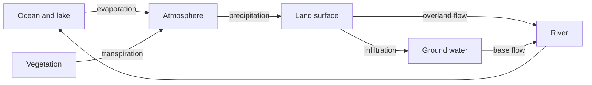

There is no new water. The same molecules have been cycling for billions
of years, and the interesting question is never how much water exists but
how long it stays in one place before moving on. That residence time —
days in the atmosphere, weeks in a river, millennia in an aquifer or an
ice sheet — is what makes some parts of the cycle forgiving and others
effectively permanent.

## The drainage basin is the unit

A **drainage basin** or watershed is all the land that drains to one
outlet, and its boundary is the height of land between it and the next
one. It is the only region in physical geography whose edges are set by a
process rather than by a survey, which is why so much environmental
management is organised around it — and why Ontario's conservation
authorities are watershed-based bodies rather than municipal ones.

Two properties of a basin decide how it behaves in a storm. **Shape and
slope** control how quickly water arrives at the outlet; a steep, round
basin delivers its water all at once. **Surface** controls how much
arrives at all: forest and soil absorb and delay, while pavement,
compacted farmland and roofs send almost everything to the channel
within minutes.

Put those together and you have the storm hydrograph — the graph of
discharge against time after rain. Urbanising a basin raises the peak and
brings it forward without changing the rainfall at all. That is the
mechanism behind most of what [[Storms and Floods]] describes, and the
reason [[Human Impact on Physical Systems]] treats paving as a
hydrological act.

## Where the water is stored

Fresh liquid water available at the surface is a very small share of the
planet's total; most fresh water is locked in ice and ground water. So
"Canada has a lot of water" is true and nearly useless as a planning
statement — what matters is whether it is where people are, when they
need it, and clean. That distinction runs through
[[Sharing a Watershed]].

%%curriculum-start%%
## Curriculum connection

![[B2.3]]

![[C1.1]]
%%curriculum-end%%
