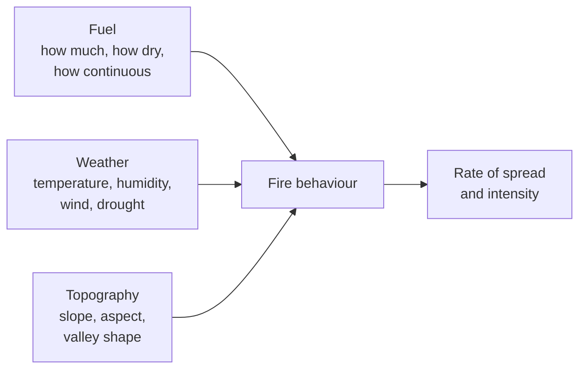

Fire is a chemical process that geography controls. Whether a lightning
strike becomes a smouldering patch or a season-defining event depends on
three things, and only one of them is the ignition.

Fuel moisture is the variable that changes fastest. A forest floor that
has been dry for weeks carries fire; the same floor after rain does not.
Wind supplies oxygen and throws embers ahead of the front, which is how
fires cross rivers and roads. Slope matters because flames preheat the
fuel above them, so fire runs uphill far faster than down — a fact worth
remembering on any slope you are standing on.

## Fire is also a renewal process

Many Canadian forest species are adapted to it. Jack pine and black
spruce hold seed in resin-sealed cones that open in a fire's heat, and
some plant communities depend on periodic burning to persist. Suppress
fire everywhere for decades and fuel accumulates, so the fire that
eventually starts burns hotter than any the ecosystem is adapted to.
That is the paradox at the centre of North American fire policy, and it
is why [[Renewing What Is Damaged]] treats fire as both damage and
repair.

**Cultural burning** — deliberate, low-intensity burning practised by
many First Nations for a very long time, suppressed under provincial and
federal fire policy, and now being carried out again in partnership with
fire agencies in parts of Canada — works on the fuel side. That makes it
one of the very few measures that reduces the hazard itself rather than
the exposure to it.

## The interface is where the losses are

Most structures lost to wildfire are lost in the **wildland–urban
interface**, where building meets vegetation. FireSmart Canada's guidance
concentrates on the ground closest to a structure: nothing combustible
in the immediate 1.5 m, and highly flammable vegetation reduced within
10 m. That is a vulnerability measure in the language of
[[Hazard, Exposure, Vulnerability]] — it does not touch the fire and it
changes the outcome.

Season severity is climate-linked, which is where [[Drought and Heat]]
and [[A Warming Planet]] come in, and
[[The 2023 Canadian Wildfire Season]] is the case we work.

%%curriculum-start%%
## Curriculum connection

![[B1.1]]

![[C1.1]]
%%curriculum-end%%
