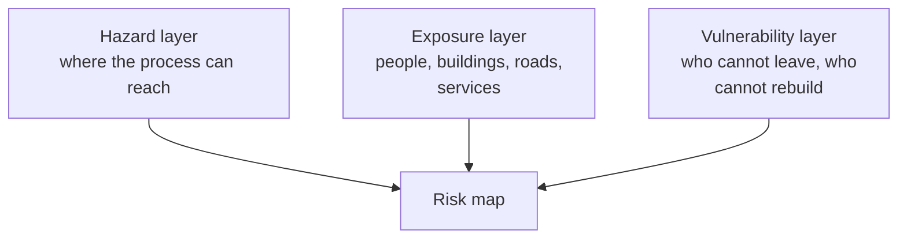

A hazard map is an argument in cartographic form, and a careless one
misleads with more authority than a careless sentence. Everything below
is about making the argument visible rather than hiding it inside the
symbology.

## Three layers, and they are not the same layer

Most published maps show only the first layer, because it is the one a
physical model produces. Adding the second is usually possible from
census and municipal data. The third is the hardest and the one that most
changes the conclusion — see [[Hazard, Exposure, Vulnerability]].

## Say what the line means

A flood-plain boundary is not the edge of wetness; it is the modelled
extent of a flood of a stated probability, under stated assumptions,
using topography of a stated date. In Ontario, conservation authorities
produce and hold that mapping under the *Conservation Authorities Act*
and Ontario Regulation 41/24, which came into effect on 1 April 2024 and
requires an authority to map the areas where development is prohibited
and publish those maps. Find yours before you draw your own.

Three habits keep a hazard map honest:

1. **State the return period or scenario.** "1-in-100-year" means an
   annual probability of about one per cent, not once a century.
2. **Date the base data.** Terrain, buildings and channels all move.
3. **Show the uncertainty.** A hard line implies a precision the model
   does not have; a graded band or an explicit note is more truthful.

## Symbology that does not lie

Use a **sequential** colour ramp for something that increases in one
direction — depth, probability, temperature — and a **diverging** ramp
only where there is a meaningful middle. Never use a rainbow ramp: the
eye reads its bands as categories and misjudges the order.

Classify carefully. The same data, cut at equal intervals, at quantiles,
or by natural breaks, produces three different maps and three different
impressions. Choose one, and write in the legend which you used.

> [!warning] A map of reported events is a map of reporting
> Places with more people, more insurance and more monitoring generate
> more records. Before you conclude that a hazard is concentrated
> somewhere, ask whether the observers are. This is the commonest error
> in student hazard maps, and it also catches professionals — see
> [[Hazard and Disaster Records]].

Build one for real ground in [[The Local Hazard Assessment]].

%%curriculum-start%%
## Curriculum connection

![[D2.1]]

![[D2.2]]
%%curriculum-end%%
