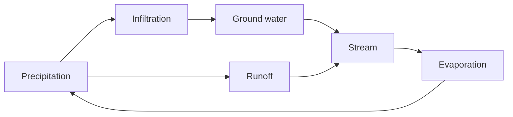
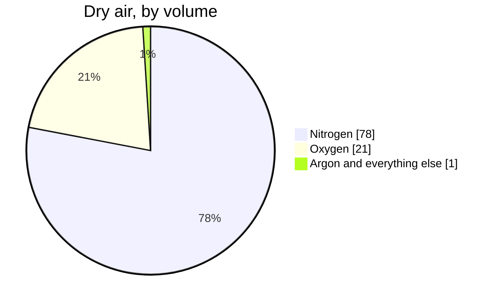

A tour of what these pages can hold — partly so you can read them, and
partly so a teacher taking this course over can write them.

## Tables

Most of physical geography is a comparison, so most pages carry a table.

| Agent | Sorts its load? | Diagnostic deposit |
| --- | --- | --- |
| Running water | Yes | Rounded, graded, layered gravel |
| Glacial ice | No | Till — clay and boulders together |
| Wind | Very well | Well-sorted, frosted, fine sand |

A link inside a table cell needs its pipe escaped, or the cell breaks:
write `[[Weathering, Erosion, and Deposition\|the processes]]` and it
renders as [[Weathering, Erosion, and Deposition\|the processes]].

## Callouts

> [!tip] A tip
> Something you can act on straight away.

> [!warning] A warning
> Something that goes wrong reliably, so it gets said loudly.

A callout with a `-` after its type starts folded:

> [!success]- A folded block
> Used for answers and check-yourself questions, so you get the chance
> to think first. You just opened it, which is the demonstration.

## Diagrams

Diagrams are written as text, so they can be edited without a drawing
program:



A proportion is sometimes clearer as a pie. Keep the title short and the
slices few — a slice under about three per cent prints its label on top
of its neighbour's:



Those are rounded percentages by volume for dry air; the tail slice holds
argon at about 0.93 per cent and carbon dioxide at about 0.04.[^air]

[^air]: A footnote is the right place for a caveat like that — it keeps
the qualification without breaking the sentence. Every number in this
course wants a source, a year, and its uncertainty.

## Checklists

- [ ] Notebook, pencil, closed shoes
- [ ] Read [[Fieldwork Safety]] before we go

> [!warning] These do not save
> A checkbox here is printed, not interactive. Nothing is recorded and
> the site does not know who you are. Copy the list into your notebook.

## Numbers and money

Amounts are ordinary text — \$14, \$2.3 billion — and the backslash
matters: without it a dollar sign can start a mathematics span and
swallow the rest of the sentence.

## What this course does not use

The site can typeset mathematics and highlight program code, and this
course does neither. Shown once so you know they exist:

$$\text{gradient} = \frac{\text{rise}}{\text{run}}$$

```python
def gradient(rise_m, run_m):
    return rise_m / run_m
```

You will calculate gradients in this course — with a ruler on a map, and
in a spreadsheet. The equation and the code are here to show the site's
range, not the course's.
