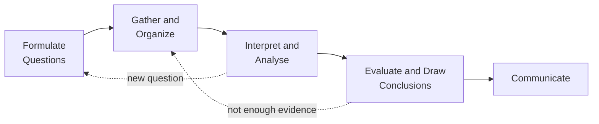

Every substantial piece of work in this course runs on the same five
steps. They are the Ministry's own names for them, and they are not a
sequence you march through once — real inquiry loops backwards
constantly, and the good version of this page says so.

## Questions come in kinds

*Factual*: what does the Gaia hypothesis describe? *Comparative*: what are
the similarities and differences between tornadoes and hurricanes?
*Causal*: how might climate change affect coastal cities? Most weak
inquiries are weak because the question was factual when it needed to be
causal — a question you can answer by looking something up will not
sustain a thousand words.

## The four concepts of geographic thinking

These are the lenses you apply at the interpreting stage, and this course
asks you to name which one you are using.

| Concept | The question it asks | Used here on |
| --- | --- | --- |
| Spatial significance | Why does this matter *here*? | Watershed boundaries, hazard extent |
| Patterns and trends | What repeats, and in which direction is it going? | Seismic zones, climate records |
| Interrelationships | What connects to what, and in which direction? | Fossil fuels and climate, land use and flooding |
| Geographic perspective | Who is affected, socially, economically, politically, environmentally? | Repeated flooding, a land-use decision |

Getting into the habit of naming the concept is worth marks in
[[The Data Examination]], and it is worth more than marks: it stops you
noticing only the thing you already expected to notice.

## Gathering, and communicating

Primary sources are your own field data, photographs and satellite
images; secondary sources are published statistics, reports, maps and
articles. A good gather is deliberately diverse, including sources that
disagree with you and sources whose authors are the people affected —
[[Where the Data Lives]], then [[Judging a Source]].

A debate, a report, a podcast, a photo essay and a briefing to a council
are all legitimate outputs. Ask what the audience needs and what they
will do with it, then choose the form that serves that rather than the
one you find easiest.

%%curriculum-start%%
## Curriculum connection

![[A1.1]]

![[A1.5]]

![[A1.6]]

![[A1.9]]
%%curriculum-end%%
