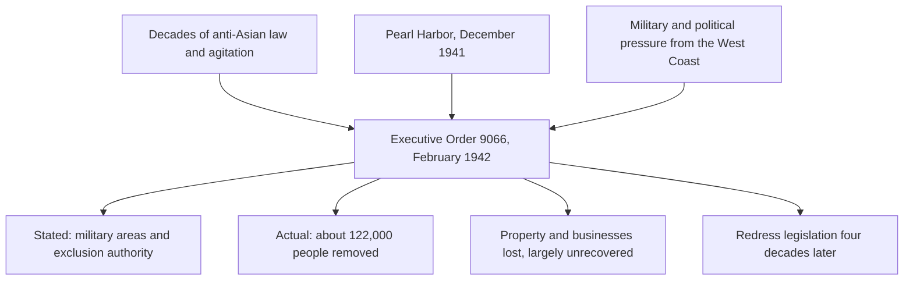

Nothing in this course happened for one reason, and nothing you study had
only the effects its authors intended. The curriculum defines the concept in
those terms: it "requires students to determine the factors that affected or
led to something (e.g., an event, situation, action, interaction, etc.) and
its impact/effects," and students "develop their understanding of the
complexity of causes and consequences, learning that something may be caused
by more than one factor and may have many consequences, both intended and
unintended."

Two phrases there do the work — **more than one factor**, and **intended and
unintended**.

## Sorting causes rather than listing them

A list of causes is not an analysis. Sort them, and say on what basis.

**Long-term conditions** are the ground an event grew in: a colonial economy
built on enslaved labour, an ocean that made enforcement slow, a population
doubling every generation.

**Short-term triggers** explain why it happened in that year rather than
twenty years later: a tax, a massacre, a harvest, an election.

**Decisions** are what historians argue about hardest, because a decision
could have gone the other way. Somebody chose, in a room, with alternatives
on the table. Name them.

## Keeping the two kinds of consequence apart

Executive Order 9066 is the clearest teaching case in the course. Franklin
Roosevelt signed it on 19 February 1942; it authorised military commanders
to prescribe military areas "in such places and of such extents" that "any
or all persons may be excluded." The National Archives notes that the order
itself contains neither the word "Japanese" nor the word "internment," and
that in the following six months approximately 122,000 men, women, and
children were forcibly moved — nearly 70,000 of them American citizens.

**The question to put to a source:** *what did the people who wrote this
expect would happen?* An order, a speech, a cabinet memorandum — each states
or implies an expected result. Set that beside what did happen, and you are
doing the concept rather than reciting it.

Test it on [[Was the Revolution Inevitable?]], then decide what mattered
most using [[Historical Significance]].

%%curriculum-start%%
## Curriculum connection

![[A1.5]]
%%curriculum-end%%
