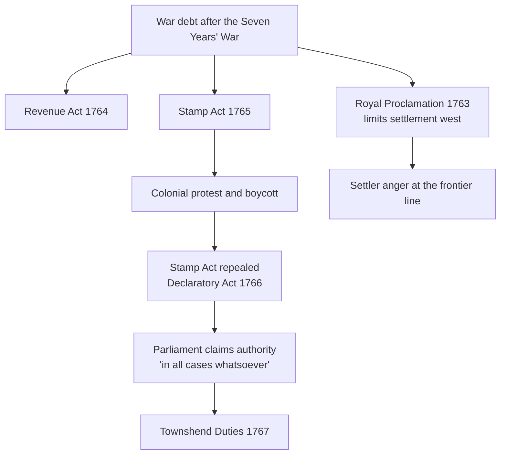

Britain did not set out to lose the American colonies. It set out to make
them pay, and the difference between those two intentions is where the
Revolution begins. For most of a century London wrote rules and enforced them
loosely. Then, after an expensive war, it began enforcing them — and
discovered that colonists had come to treat the loose enforcement as a right.

## Rules, and the habit of not enforcing them

The Navigation Acts required that colonial trade move in British ships
through British ports. On paper this made the colonies a captive market. In
practice, for decades, smuggling was widespread and prosecutions were rare.
Historians call the period of deliberate non-enforcement *salutary neglect* —
a phrase that describes a policy nobody ever formally announced.

Britain was not the only imperial power writing rules on this continent, and
its colonies were shaped by the neighbours. France held the St. Lawrence and
claimed the Mississippi basin, trading through alliances rather than large
settlements. Spain governed Florida and, later, the Southwest through
missions and presidios. The Dutch had the Hudson before the English took it,
and Sweden had a short-lived hold on the Delaware. Each left names, laws,
land tenure and populations behind, and none of it was erased by the change
of flag.

## What changed after 1763

Read that diagram as an argument, not a chain of dominoes. Britain's position
was coherent: the war had been fought partly for colonial security, the debt
was real, and Parliament held sovereign authority. The colonial position was
also coherent: taxes are granted by the taxed through their own
representatives, and colonists elected nobody to Parliament. Two defensible
constitutional readings collided, which is why the argument lasted a decade
before it became a war.

The Quebec Act of 1774 tightened the knot. By recognising Catholic worship
and extending Quebec's boundaries toward the Ohio country, it offended
colonists on two counts at once — religious prejudice and land hunger — and
was folded into the list of grievances even though it was not a tax at all.

Trace the outcome in [[Revolution and the Republic It Made]], and take the
causal question itself into [[Was the Revolution Inevitable?]].

%%curriculum-start%%
## Curriculum connection

![[B1.3]]

![[B3.1]]
%%curriculum-end%%
