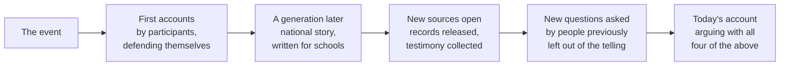

The same event gets retold differently in every generation, and the pattern
of the retellings is itself evidence — about the retellers, their moment,
and what they needed the past to mean. Historiography is the study of that
pattern, and by Unit 4 you have enough history behind you to do it.

The curriculum expects you to weigh interpretations directly. One of its
sample questions for this course asks: "How does this source view President
Kennedy's response to the Cuban Missile Crisis? Is the author's
interpretation consistent with that in your other sources? If not, how will
you decide which argument is most persuasive?" That last question is the
assignment. Deciding is your job.

## Why accounts change

Four things move an interpretation: **new evidence** becomes available; **new
questions** get asked because different people are now asking; **the present
changes** and makes some parts of the past newly useful; and **an earlier
account gets attacked**, so the next one is shaped by that fight.

Only the first is about the past. The other three are about the historian,
which is why a shelf of books on one event is a primary source for the
century that produced the shelf.

## How to handle two accounts that disagree

Do not split the difference. Ask, in this order: do they disagree about
**what happened**, about **what caused it**, or about **what it meant**? A
factual disagreement is settled with sources. A causal disagreement is
settled with argument about weighting. A disagreement about meaning is often
not a disagreement about history at all.

Then ask what each account is built on. An interpretation resting on records
its author could not have read in 1955 is not more virtuous, but it is
better fed — and one resting on testimony that only became available later
is answering a question the earlier writer could not ask.

## Saying it in your own writing

Name the interpretation you are arguing with, and say when it was made. "For
much of the twentieth century the standard account held X; the records
released since then support Y" is a historiographical sentence. "Historians
now believe" is not one — there is no such body, and it does no work you can
be held to.

Take this into [[Whose Story Gets Taught?]] and into
[[Arts, Culture, and Consumer Society]], where a country tells itself the
story it wants and then sells it abroad.

%%curriculum-start%%
## Curriculum connection

![[A1.4]]

![[A1.6]]
%%curriculum-end%%
