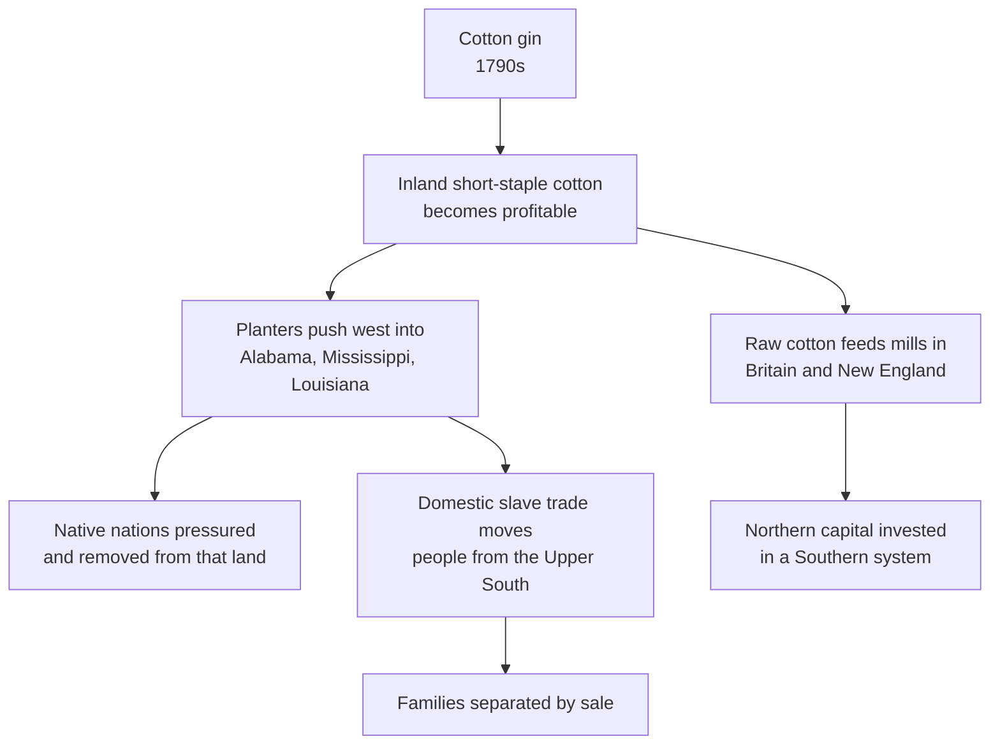

Technology in this period did not simply make life easier. It made some
things possible that had not been, and in doing so it decided where people
lived, what they grew, who they worked for, and — in one enormous case — how
many people were held in bondage and where. Treat each invention as a cause
with consequences that run in more than one direction.

## The invention that expanded slavery

Short-staple cotton grows across the inland South but its sticky seeds made
cleaning it by hand painfully slow. A machine that separated seed from fibre
removed that bottleneck, and the consequences were not the ones its inventor
advertised.

Read the two branches at the bottom together. The mills of Massachusetts and
Lancashire ran on cotton grown by enslaved people, and the merchants,
insurers and bankers who financed the trade were disproportionately northern.
"The North had no stake in slavery" does not survive contact with the ledgers.

## Distance, and the shrinking of it

Steamboats made rivers two-way. The Erie Canal, opened in 1825, connected
the Great Lakes to the Hudson and made New York the country's commercial
capital by giving it a cheap route to the interior. Railroads spread from the
1830s and did to overland freight what the canal had done to the corridor it
served. The telegraph split communication from transportation for the first
time in human history — a message could now outrun the messenger.

Each of these required capital on a scale individuals did not have, which is
why this is also the period of corporations, banks, and fierce political
fights about them. The Bank War of the 1830s was a genuine argument about
whether concentrated financial power was compatible with a republic, and it
is not obvious that either side was simply wrong.

## Where it landed unevenly

Mechanized farm equipment favoured large flat fields, which favoured the
Midwest and larger owners. Factory work drew young women and children into
wage labour on terms set by the employer. Gold in California from the late
1840s pulled a rush of migrants across the continent and into the territory
of nations who had not been consulted, with lethal results for them.

Sort the winners from the losers with [[Cause and Consequence]], and connect
the machinery to the institution in [[Slavery]].

%%curriculum-start%%
## Curriculum connection

![[C1.3]]

![[C1.4]]
%%curriculum-end%%
