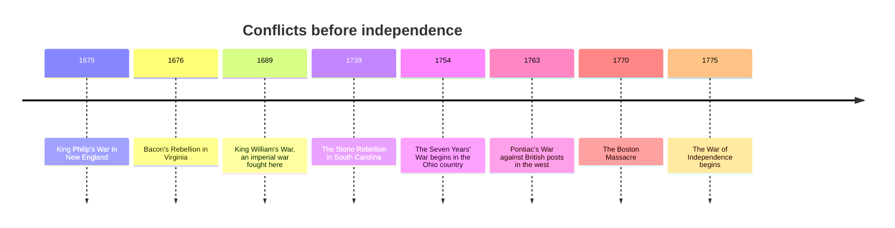

Colonial North America was fought over almost continuously, and most of the
fighting was about the same thing in different clothes: who would control
land, water and the routes between them. Reading these conflicts as episodes
in a march toward 1776 gets them backwards. Read them instead as arguments
about resources, in which the environment set the stakes and the participants
chose their sides for their own reasons.

## A century of it

Take one of them properly. Metacom, the Wampanoag leader the English called
King Philip, went to war after decades in which English settlement, English
courts and English livestock had steadily narrowed what his people could do
on their own land. From the English side this was a rebellion; from the
Wampanoag side it was a last defence of sovereignty. The war was
proportionally among the deadliest ever fought on this continent, and it
ended Native military power in southern New England. Both descriptions are
accurate. Only one of them was taught for three hundred years.

## Why the environment is a cause and not a backdrop

Where the land was good for tobacco, plantations spread and pushed against
Native territory. Where the soil was thin and the winters long, as in New
England, towns clustered and expansion moved along rivers. The Ohio country
mattered to Britain, France and half a dozen Native nations at once because
it was the door between the seaboard and the Mississippi — a fact of
geography that generated a world war.

Colonists' first years show the same logic at close range. Jamestown was
sited on a defensible peninsula with brackish water and few fish, and its
settlers starved; Plymouth arrived at the wrong season and survived the first
winter only partly. Both learned from Native agriculture what would actually
grow. Environment did not decide these outcomes on its own, but it set the
terms every group had to answer.

The Seven Years' War is the pivot. Britain won North America, acquired the
debt that produced the taxes, and lost the French counterweight that had made
British colonists valuable allies. Native nations lost the ability to balance
one empire against another — which is precisely why Pontiac's war followed.

Weigh those consequences with [[Cause and Consequence]], and carry the
question into [[Was the Revolution Inevitable|Was the Revolution Inevitable?]].

%%curriculum-start%%
## Curriculum connection

![[B2.2]]

![[B2.4]]
%%curriculum-end%%
