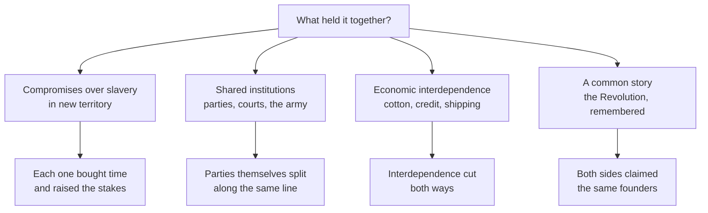

Between 1791 and 1861 the United States repeatedly came close to breaking
and repeatedly did not, until it did. The usual question is why it broke.
This investigation asks the inverse, which is harder and more revealing:
what actually held it together for seventy years, and why did those things
stop working?

## The candidates

Take each branch as a claim to be tested, not a fact. The most interesting
is the first: a compromise that postpones a conflict may be holding a
country together or may be storing the conflict at interest. Both are
arguable from the same sequence — the Missouri Compromise, the Compromise of
1850, Bleeding Kansas, and the crisis of 1860–61.

## The evidence set

Statute and constitutional text for each settlement, read for exactly what
was conceded and by whom. Congressional debate, where the arguments are made
in public by people who had to win votes. Party platforms across successive
elections, which show a national organisation splitting in slow motion. The
secession declarations issued by seceding states, which state their own
reasons at length and should be read in full rather than summarised. And
economic series from [[Statistics and the Census]] on cotton, population and
railways, which tell you what each region had to lose.

## The trap in this question

"The Union held together because of X" is not testable unless you say what
would have happened without X. Force yourself to name, for each candidate, a
moment when it was under strain and either did or did not hold. That is what
converts a list into an argument, and it is the discipline
[[Continuity and Change]] exists to enforce: two dated points, one thing
compared.

Take care with the word "sectional." It is the period's own vocabulary and
it quietly turns a dispute about whether human beings could be owned into a
disagreement between two regions of equal standing. Quote it; do not adopt
it. [[Historical Perspective]] explains why the distinction matters.

## What the class produces

A ranked explanation with criteria stated first, and one paragraph on the
counterfactual you consider strongest. Bring the result to
[[Could the Civil War Have Been Avoided?]] and use it in
[[The Union Divided]].

%%curriculum-start%%
## Curriculum connection

![[C2.3]]

![[C1.5]]
%%curriculum-end%%
