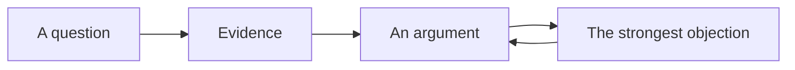

A tour of what these pages hold — partly so you can read them, partly so
a teacher taking this course over can write them.

## Tables

| Source | Strong evidence of | Weak evidence of |
| --- | --- | --- |
| A recruiting poster | How the state wanted enlistment understood | How many enlisted |
| A census schedule | What the state counted, and how it categorised | What people called themselves |

A link inside a table cell needs its pipe escaped, or the cell breaks:
`[[Slavery\|the system]]` renders as [[Slavery\|the system]].

## Callouts

> [!tip] A tip
> Something to do differently in the next paragraph you write.

> [!warning] A warning
> A mistake this course sees every year.

Folded, for a question you should try before reading the answer:

> [!success]- A folded block
> You just opened it. That is the demonstration.

## Diagrams



## Checklists

- [ ] Provenance established before reading for content
- [ ] Every claim carries a citation

> [!warning] These do not save
> A checkbox here is printed, not interactive. Nothing is recorded.
> Copy the list into your notebook.

## Footnotes

Useful for a caveat that would break the sentence.[^figures]

[^figures]: Where a figure is contested, this course states the
authoritative body's own number and its stated uncertainty rather than a
rounded one. That habit is assessed.

## Money and numbers

Amounts are ordinary text — \$14, \$2.3 million — and the backslash
matters: without it a dollar sign can start a mathematics span and
swallow the sentence.

## What this course does not use

The site can typeset mathematics and highlight code, and this course does
neither:

$$\text{turnout} = \frac{\text{votes cast}}{\text{eligible voters}}$$

```python
print("not used in this course")
```

Your arguments are made of documents and prose. These are here to show
the site's range, not the course's.
