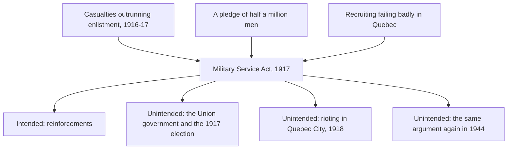

Nothing in this course happened for one reason, and nothing you study had
only the effects its authors intended. The curriculum defines the concept in
exactly those terms: it "requires students to determine the factors that
affected or led to something (e.g., an event, situation, action,
interaction) as well as its impact/effects," building "an understanding of
the complexity of causes and consequences, learning that something may be
caused by more than one factor and may have many consequences, both intended
and unintended."

Two phrases there do the work — **more than one factor**, and **intended and
unintended**.

## Sorting causes rather than listing them

A list of causes is not an analysis. Sort them, and say on what basis.

**Long-term conditions** are the ground an event grew in: Canada's place
inside the British Empire, an economy resting on wheat and resource exports,
an immigration system that ranked applicants by where they came from.

**Short-term triggers** explain why it happened in that month rather than
five years later: a casualty return, an election, a bank failure.
**Decisions** are what historians argue about hardest, because a decision
could have gone the other way. Somebody chose. Name them.

## Keeping the two kinds of consequence apart

Conscription in 1917 was meant to reinforce the Canadian Corps after the
government pledged half a million men from a country of about eight million.
It did send men. It also cost the governing party its support in Quebec,
produced rioting in Quebec City at Easter 1918, and opened a fault line the
country was still stepping around in 1944.

**The question to put to a source:** *what did the people who wrote this
expect would happen?* A cabinet minute, a recruiting speech, a memo — each
one states or implies an expected result. Set that beside what did happen,
and you are doing the concept rather than reciting it.

Test it on [[Was Conscription Necessary?]], read the split it caused in
[[Conscription and the Country It Split]], then decide what mattered most
using [[Historical Significance]].

%%curriculum-start%%
## Curriculum connection

![[A1.5]]
%%curriculum-end%%
